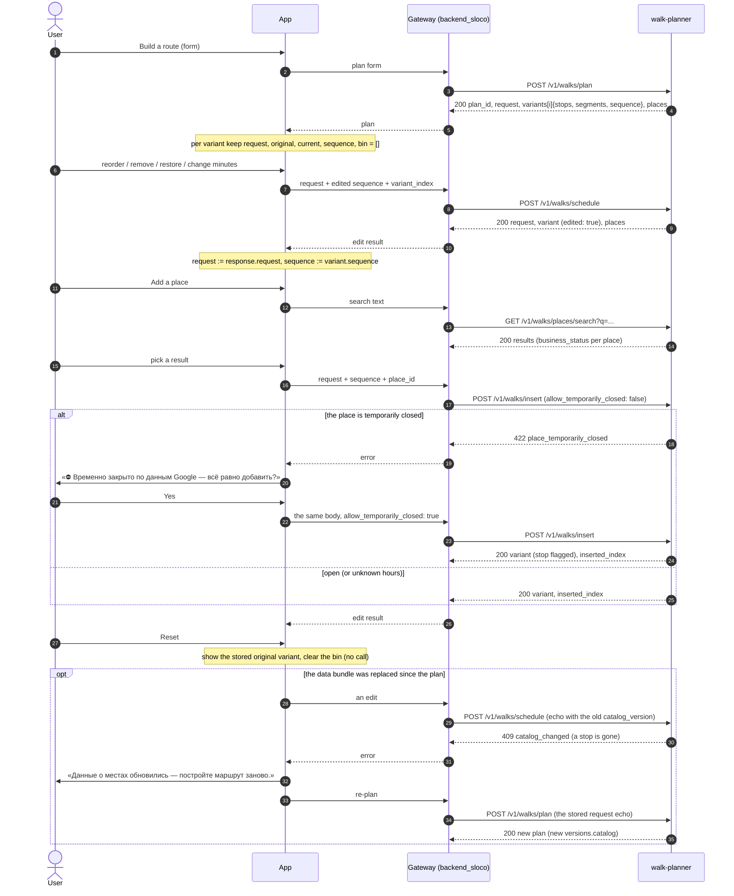

# Walk Planner HTTP API — v1

Reference for the backend developer who connects the **`walk-planner`** service to the app gateway
(`backend_sloco`, Fastify/TS). The service plans walking routes in a city and lets the app edit them.

| | |
|---|---|
| Service | `walk-planner`: FastAPI (Python), internal, **no authentication** |
| Base URL | `http://walk-planner:8000` on the Docker network (the compose service name); `http://127.0.0.1:18600` on the host, for smoke tests |
| Base path | `/v1` (every endpoint) |
| Versions described | API `v1`, algorithm `1.0.0`, data bundle `bucharest-20261002-d68a311e` |
| Machine-readable contract | [`openapi.json`](openapi.json) (OpenAPI 3.1, generated from `walk_planner/service/schemas.py` + `service/app.py` by `tools/export_openapi.py`; CI fails when it is stale). It is exact on paths, field names and JSON types, but in a few places it is looser or stricter than the service: [§4.0](#40-schema-names-and-the-gaps-of-openapijson) lists them. The running service also serves `GET /openapi.json` and Swagger UI at `GET /docs` (Swagger UI loads its JS/CSS from a CDN) |
| Message and error catalog | [`messages.md`](messages.md) (texts, params, guidance) and [`messages.json`](messages.json) (generated by `tools/export_messages.py`) |
| Source of truth | the code: `walk_planner/present.py` (response JSON), `walk_planner/pipeline.py` (request rules, editing), `walk_planner/messages.py` (codes), `walk_planner/service/app.py` + `schemas.py` (HTTP). Where this page and the code disagree, the code wins. Where `openapi.json` and the service's behaviour disagree, the behaviour described here wins ([§4.0](#40-schema-names-and-the-gaps-of-openapijson)) |
| Related | [SPEC.md](SPEC.md) (overview), [INTEGRATION.md](INTEGRATION.md) (the gateway: its app-facing endpoints and key mapping, timeouts, retries, caching, client state), [ROUTING.md](ROUTING.md) (street routing), [DEPLOY.md](DEPLOY.md) (settings, operation) |

**About the examples.** Every example is real output, not hand-written:

- plan / schedule / insert examples are cut from the golden files
  `golden/expected/bucharest-20261002-d68a311e/<scenario>.json` (straight-line routing, `lang=ru`,
  `geometry=geojson`, no `PHOTO_BASE_URL`, so photo `url`s are `null`). The scenario is named under each example;
- the error bodies of `/insert` and the `duplicate_activity` error come from the mini golden set
  `tests/fixtures/mini/expected/minitown-20261002-17bd5998/` (a synthetic 60-place city);
- config, search, place, meta, health and the other error bodies were captured from the service itself on
  2026-10-03 (in-process, the same Bucharest bundle, straight-line routing,
  `PHOTO_BASE_URL=https://api.example.com/walk-media`).

Examples are shortened. In an array, a `"..."` element stands for the removed items; `"..."` as a value stands for
a removed object. Numbers are shown exactly as the service sends them (unrounded floats).

## Contents

1. [Overview](#1-overview)
2. [Conventions](#2-conventions) — transport, codes, place ids, time, units, coordinates, language, options,
   determinism and `plan_id`, versions, headers, limits, errors, load guard and timeouts
3. [Endpoints](#3-endpoints)
4. [Objects](#4-objects) — field tables of every response object
5. [Editing flow](#5-editing-flow)
6. [Rendering guidance](#6-rendering-guidance)
7. [Known limitations of v1](#7-known-limitations-of-v1)
8. [Example index](#8-example-index)

---

## 1. Overview

A **walk** is a city-local date and time window, an ordered list of activity **slots** (sight, coffee, food, ...),
optional **must-visit** places, a **style**, a **shape** and a **start**. `POST /v1/walks/plan` returns up to five
different route **variants**. Each variant has timed **stops**, walking **segments** with geometry, Google / Apple
Maps **navigation** links, and an editable **sequence**.

Editing is **stateless**: the service stores nothing. The app keeps the plan's `request` echo and the variant's
`sequence`, edits the sequence (reorder, remove, restore, change minutes) and sends both to
`POST /v1/walks/schedule`, or adds a catalog place with `POST /v1/walks/insert`. The service re-reads every
catalog fact (names, coordinates, opening hours, status) by `place_id`; the client never supplies them.

| Method | Path | Purpose | Load guard | Latency (measured, one request) |
|---|---|---|---|---|
| GET | `/v1/health/live` | liveness probe | no | < 1 ms |
| GET | `/v1/health/ready` | readiness probe | no | < 1 ms |
| GET | `/v1/meta` | identity, versions, loaded bundles, routing state, load | no | < 1 ms |
| GET | `/v1/walks/config` | form data of a city: codes, labels, defaults, limits | no | < 1 ms |
| POST | `/v1/walks/plan` | plan 1–5 route variants | **yes** | 0.3–0.45 s (0.35–0.5 s with favourites); 24-hour windows 3–4 s; plus street routing (budget 6 s) |
| POST | `/v1/walks/schedule` | re-time an edited order, exactly as given | **yes** | 3–4 ms (30–55 ms when the echo carries favourites) plus street routing |
| POST | `/v1/walks/insert` | add one catalog place at its best position | **yes** | 3–4 ms (more with favourites, as schedule) plus street routing |
| GET | `/v1/walks/places/search` | find places by name | no | 8–15 ms |
| GET | `/v1/walks/places/{place_id}` | place screen | no | ~1 ms |

Latencies are server times (`X-Process-Time-Ms`, p50) of one request at a time, with the real bundle and
straight-line routing. The lower bound is the service on a MacBook (M1 Pro), the upper one the Linux image under
Docker Desktop on the same machine. The measured table, with p90 and the conditions, is in
[SPEC.md §10](SPEC.md#10-performance-and-capacity). With self-hosted OSRM the router added ~10 ms to a default plan.
See [§2.14](#214-load-guard-latency-timeouts-and-retries).

**Routing.** The service routes the final walking legs through self-hosted OSRM, then the ORS cloud, then a
straight-line estimate (whatever is configured and answers). The planner's choice of places and their order
**never** depends on the router: the optimizer always uses the straight-line estimate. The router only changes the
walking minutes, distances and line geometry that are shown, and every segment says which one it got
(`quality`: `streets` | `estimate`).

---

## 2. Conventions

### 2.1 Transport

- JSON over HTTP. Send `Content-Type: application/json`. Responses are compact UTF-8 JSON
  (`application/json`). Responses never contain `NaN` or `Infinity`; requests with them are refused (422).
- A POST body must be one JSON object of at most `WALK_MAX_BODY_BYTES` (default 1 MiB, larger gets 413
  `payload_too_large`). A plan request is ~1–15 KB (15 KB with 500 favourites); an edit with the maximum
  150 stops is ~25 KB.
- No authentication and no CORS: only the gateway may reach the service (internal network; the compose file
  publishes the port on loopback only).
- Every endpoint is free of side effects (no per-user state on the server), so repeating a request is always
  **safe**, POSTs included: it gives the same answer and changes nothing. Safe is not free, though. A plan whose
  caller timed out keeps running on the server and holds a CPU and a load-guard slot, so the gateway does not re-send
  a plan after a timeout. It retries only on 503 `busy` / `not_ready` and on a refused connection
  ([INTEGRATION.md §3.5](INTEGRATION.md#35-timeouts-and-retries)).

### 2.2 Names and codes

- Keys are `snake_case`. Enumerations are lowercase **codes**, never labels. The labels of activities, styles and
  shapes come from [`GET /v1/walks/config`](#34-get-v1walksconfig).
  - One leftover of the dashboard: in `slots`, the service still accepts the dashboard's **Russian activity
    labels** (`"Кофе"`, `"Парк / природа"`, …) and turns them into codes, so the `request` echo always carries
    codes. Do not rely on it: send codes. English labels (`"Coffee"`) are refused with 422 `unknown_activity`, and
    Russian style or shape labels with 422 `validation_error`. The CLI accepts all Russian labels.
- Requests: unknown keys are ignored.
- Responses: read them tolerantly. Ignore keys you do not know, treat an unknown message code as informational
  and an unknown error code by its HTTP status. Codes are append-only.

| Enumeration | Values |
|---|---|
| activity | `sight`, `coffee`, `food`, `bar`, `park`, `market`, `entertainment`, `shopping` (the config's order) |
| style | `max` (as many places as fit), `chill` (fewer places, 1.3× longer visits), `scenic` (walks more; on-the-way stops are parks and squares) |
| shape | `loop` (back to the start), `one_way` (ends at the last stop), `free` (no start: around the city centre) |
| stop kind | `slot` (fills a requested slot), `on_the_way` (optional extra stop), `pinned` (the user's own place: must-visit or added) |
| hours status | `open`, `open_after_wait`, `unknown`, `closes_during_visit`, `closed_at_arrival`, `not_checked` ([§4.10](#410-hours)) |
| business status | `operational`, `temporarily_closed`, `closed_forever` |
| routing quality | segment `quality`: `streets` \| `estimate`; variant `summary.routing`: `streets` \| `estimate` \| `mixed` \| `none`; segment `provider`: `osrm` \| `ors` \| `haversine` |
| plan status | `ok`, `no_candidates`, `no_route` |
| personalization mode | `favourites`, `popularity` |
| search match | `exact`, `prefix`, `substring`, `all_words`, `address` |
| message | severity `info` \| `warning` \| `error`; scope `request` \| `variant` \| `stop` |
| catalog data | `theme_group`: `food_drink`, `sights`, `things_to_do`, `shopping`. `theme` (Bucharest): `food_drink`, `culture_sights`, `leisure_active`, `nature_outdoors`, `shopping_souvenirs`, `religious_sights`, `performing_arts`, `markets_walks`, `transport_resorts`. `price_level`: `inexpensive`, `moderate`, `expensive`, `very_expensive` or `null`. `ai_confidence`: `high`, `medium`, `low` |

### 2.3 Place ids

`place_id` is the **Google CID as a decimal string**: `^[0-9]{1,20}$`, for example `"10915586233752676659"`.

- **Never a JSON number.** In the Bucharest catalog 12,954 of 12,961 CIDs exceed 2^53 (a JavaScript number cannot
  hold them exactly), and 6,442 exceed the int64 maximum (9223372036854775807). A place id sent as a number is
  refused with 422 `validation_error`.
- Keep it a `string` in TypeScript and in the database (`text`, or `numeric(20,0)`; **not** `bigint`).
- `google_place_id` (`ChIJ…`) is a different Google id. It is used in navigation links and is informational.

```json
{"error": {"code": "validation_error",
           "message": "Некорректный запрос: body.must_visit_place_ids.0 — Input should be a valid string.",
           "params": {"errors": [{"loc": ["body", "must_visit_place_ids", 0], "type": "string_type",
                                  "msg": "Input should be a valid string", "input": 10915586233752676659}]}}}
```

### 2.4 Time

- **Everything is city-local wall-clock time**, in the city's IANA zone (`request.timezone`, e.g.
  `Europe/Bucharest`). The request carries no UTC offset.
- Request formats: `date` `"YYYY-MM-DD"`; `start_time` / `end_time` `"HH:MM"` (24 h, two digits each,
  `00:00`–`23:59`).
- **Window.** It starts at `date` + `start_time` and ends at `end_time`, on the same day or, with
  `end_day_offset: 1`, the next day. Its length must be 15 min to 24 h.
  - Without `end_time` the window is 4 h.
  - Without `end_day_offset` an `end_time` at or before `start_time` means the next day (`20:00`–`01:00` is 5 h;
    `10:00`–`10:00` is 24 h).
  - An explicit `end_day_offset: 0` with `end_time` ≤ `start_time` gives 422 `invalid_window`.
  - The response echoes the result as `request.window_start` / `window_end` / `window_min`.
- **TimePoint** — every moment of a walk: `{"offset_min": <float>, "local": "YYYY-MM-DDTHH:MM"}`.
  - `offset_min`: minutes after the departure (`request.window_start`); unrounded.
  - `local`: the city-local clock, rounded to the minute with Python's `round` (half to even). Example:
    `{"offset_min": 0.6009142608414245, "local": "2026-10-03T10:01"}`.
  - The date part tells the client when a time falls after midnight: `"2026-10-04T00:34"` in a walk that started
    on the 3rd. The dashboard shows that as `00:34 (+1)`.
- `weekday`: 0 = Monday … 6 = Sunday (the weekday of `date`).
- Opening-hours times (`"HH:MM"`) are wall-clock too; `close_day_offset: 1` means the place closes after
  midnight (a close of `"00:00"` with offset 1 is midnight).
- To get an absolute instant, combine `local` with `request.timezone`. The service adds minutes to a naive local
  time, so on the two DST-change nights a time after the change is one hour off ([§7](#7-known-limitations-of-v1)).

### 2.5 Units and numbers

| Quantity | Unit | Where |
|---|---|---|
| durations, offsets | minutes, float (unrounded) | `walk_min`, `dwell_min`, `wait_min`, `total_min`, `slack_min`, `offset_min`, `base_dwell_min` |
| window length | minutes, integer | `window_min` |
| distance of a variant | kilometres, float | `summary.distance_km` |
| distance of a segment | metres, integer (rounded) | `segment.distance_m` |
| distance in search | metres, integer | `distance_m` (only when `lat`/`lon` were given) |
| radius | kilometres, float | `radius_km`, `search_radius_km`, `debug.search_km` |
| rating | 1–5, float | `rating` (`null` when missing) |
| interest | 0–1, float | `stop.interest` |

Round for display only. The dashboard rounds minutes half-to-even (`f"{x:.0f}"`): 97.5 → 98, 58.5 → 58.

### 2.6 Coordinates and geometry

- WGS84 degrees, **6+ decimals** (`44.4402865461307`).
- Points are objects or fields named `lat` / `lon`: `start`, `stop.lat/lon`, `card.lat/lon`, `config.center`.
- **Geometry uses GeoJSON order `[lon, lat]`**: `segment.geometry` is
  `{"type": "LineString", "coordinates": [[lon, lat], ...]}`, and `bbox` is `[minLon, minLat, maxLon, maxLat]`.
  The only exception is the bench-only `debug.area`, which is `[lat, lon]`.
- **`geometry=polyline6`** (option, [§2.8](#28-response-options)): each segment carries `geometry_polyline6`, a
  Google encoded polyline at precision 1e-6 (lat, lon order inside the encoding, as in OSRM's `polyline6`), instead
  of `geometry`. Decode it with any polyline library at precision 6 (e.g. `@mapbox/polyline`:
  `polyline.decode(s, 6)` returns `[[lat, lon], ...]`). It is much more compact than GeoJSON for street geometry.
- With the straight-line estimate a segment is a two-point line (from, to). With street routing it follows the
  streets (2–63 points per segment, median 19, measured with OSRM).
- Navigation URLs carry coordinates as `lat,lon` with 6 decimals.

```json
{"index": 0, "from": {"kind": "start", "stop_index": null}, "to": {"kind": "stop", "stop_index": 0},
 "walk_min": 0.6009142608414245, "distance_m": 45,
 "depart": {"offset_min": 0.0, "local": "2026-10-03T10:00"},
 "arrive": {"offset_min": 0.6009142608414245, "local": "2026-10-03T10:01"},
 "quality": "estimate", "provider": "haversine", "geometry_polyline6": "}llwsAwa{wp@jAcY"}
```
<sub>S01 plan with `?geometry=polyline6&lang=en`, first segment (captured).</sub>

### 2.7 Language

`lang` is `ru` or `en`; the default is `WALK_DEFAULT_LANG` (`ru`). It changes only:

- the `text` of every message and the `message` of every error;
- the `label` of activities, styles and shapes in the config (`label_ru` and `label_en` are always both there).

Data is never translated. Place names are local (mostly Romanian). AI texts (`summary`, detail `sections`,
`type_label`) are English (`summary_lang: "en"`). Detail sections carry both `title_ru` and `title_en`.

Clients should localize messages themselves from `code` + `params` ([messages.md](messages.md)); `text` is a
convenience. Request-format errors (`validation_error` with `params.errors`) carry pydantic's English wording in
both languages.

### 2.8 Response options

| Option | Values | Default | Endpoints |
|---|---|---|---|
| `lang` | `ru` \| `en` | `WALK_DEFAULT_LANG` (`ru`) | all `/v1/walks/*` |
| `geometry` | `geojson` \| `polyline6` | `WALK_GEOMETRY_DEFAULT` (`geojson`) | plan, schedule, insert |
| `debug` | `true` \| `false` | `false` | plan only (bench) |

Each option can be a query parameter (`?lang=en`) or a body field (`"lang": "en"`). Giving both with different
values is a 422 `validation_error` (`params.field` names the option).

The language of an **error** is chosen in this order: the request's resolved `lang`, then `?lang=`, then the
body's `"lang"`, then the default.

### 2.9 Determinism and `plan_id`

- **Deterministic.** The same request on the same bundle and algorithm version gives the same plan. With the
  straight-line estimate the response is identical: byte for byte on one platform, and up to last-bit float noise
  across platforms (macOS vs Linux), which the golden comparison tolerates (1e-6). With street routing the stops and
  their order are still identical, because the optimizer uses the estimate. Only walking minutes, distances and
  geometry follow the router, and they fall back to the estimate when the router fails.
- **`plan_id`** is 40 hex characters: the SHA-1 of the normalized request echo plus `versions`. It identifies the
  **inputs** (request, data bundle, algorithm, interest model, OSRM dataset), not the bytes of the response.
  - The same request (favourites included) gives the same `plan_id` while the data and versions stay the same, on
    the same service image (the echo holds floats such as the city centre, whose last bits can differ between numpy
    builds).
  - It changes when the bundle, the algorithm, the interest model or the OSRM dataset changes.
  - Two responses with the same `plan_id` can differ in walking times if the router fell back to the estimate
    for one of them.
  - `versions.routing` stays `null` until a worker has learned the OSRM `data_version` (its first routed request
    or probe), so right after a start the `plan_id` of a request can change once.
  - Use it as a cache key or for analytics. The service stores nothing: there is no endpoint that fetches a plan
    by its id.
- Re-sending the `request` echo of a response as a plan request reproduces the plan (same `plan_id`): S01's echo
  sent to `/v1/walks/plan` gives `dd4b84b018a6b423626abeeeaf4a36408fea3a60` again (captured).

### 2.10 Versions

`versions` is in the plan, schedule, insert and config responses:

```json
{"api": "v1", "algorithm": "1.0.0", "catalog": "bucharest-20261002-d68a311e", "interest": "walk_interest_v1",
 "routing": null}
```

| Field | Meaning |
|---|---|
| `api` | API version (path prefix `/v1`) |
| `algorithm` | `walk_planner` ALGORITHM_VERSION, semver: MAJOR = API break, MINOR = intended change of plans, PATCH = no change of any golden output |
| `catalog` | id of the data bundle: `<city>-<YYYYMMDD>-<content sha8>` |
| `interest` | version of the personalization model |
| `routing` | OSRM `data_version` once this worker knows it (street routing), else `null` |

### 2.11 Headers

| Header | Direction | Meaning |
|---|---|---|
| `X-Request-Id` | request → response | Send your own id (`^[A-Za-z0-9._:\-]{1,128}$`) to correlate with the service log; it is echoed. Otherwise, or when it does not match, the service generates a 32-hex id. Every access-log line carries it (`golden run --url` sends `golden-<scenario>-0` for the plan and `golden-<scenario>-<chain><step>` for edits, e.g. `golden-S01_default-A0`) |
| `X-Process-Time-Ms` | response | Server time until the response started, ms with one decimal (`"312.8"`) |
| `Retry-After` | response (503) | Seconds to wait: `2` for `busy`, `5` for `not_ready` |
| `Content-Type` | both | `application/json` |

### 2.12 Limits

Published at runtime by `GET /v1/walks/config` (`limits`, `defaults`).

| What | Limit | When exceeded |
|---|---|---|
| request body | `WALK_MAX_BODY_BYTES` (1 MiB; configurable 1 KiB–64 MiB) | 413 `payload_too_large` |
| window (`end − start`) | 15–1440 min | 422 `invalid_window` |
| `variants` | 1–5 | 422 `validation_error` |
| `radius_km` | 0.3–50 | 422 `validation_error` |
| `slots` | ≤ 8, each activity at most once | 422 `validation_error` / `duplicate_activity` |
| slot `dwell_min` | integer 5–480, or `null` | 422 `validation_error` |
| `must_visit_place_ids` | ≤ 10 (after removing duplicates) | 422 `too_many_must_visits` |
| `favourite_place_ids` + `want_to_go_place_ids` | ≤ 500 together (each list de-duplicated first); at most 200 are used as taste seeds | 422 `validation_error` (`field: favourite_place_ids`) |
| `personalization_strength` | 0–1 | 422 `validation_error` |
| `top_k` (bench only) | 1–50 | 422 `validation_error` |
| `sequence` (edits) | ≤ 150 stops, unique places | 422 `validation_error` |
| edit `dwell_min` | 5–480 (float) | 422 `validation_error` |
| `variant_index` | integer 0–99 | 422 `validation_error` |
| `city` | ≤ 100 characters | 422 `validation_error` |
| search `q` | 1–200 characters | 422 `validation_error` |
| search `limit` | 1–50 (default 20) | 422 `validation_error` |
| place id | `^[0-9]{1,20}$` | 422 `validation_error` |
| concurrent plan / schedule / insert per worker | `WALK_MAX_CONCURRENT_PLANS` (2; 1–64) | 503 `busy` + `Retry-After: 2` |

### 2.13 Errors

Every non-2xx response has the same envelope:

```json
{"error": {"code": "unknown_place", "message": "Место 3333333333333333333 не найдено в каталоге.",
           "params": {"place_id": "3333333333333333333", "field": "place_id"}}}
```

- `code` is stable; branch on it.
- `message` is rendered in `lang`.
- `params` holds machine-readable details. Their keys per code are listed in [messages.md](messages.md).

| HTTP | Codes | Meaning |
|---|---|---|
| 400 | `bad_request` | A body the server cannot read at all (JSON nested 100k deep, an integer with thousands of digits). Ordinary malformed JSON is a 422 |
| 404 | `unknown_place` | A place id that is not in the catalog (`params.field` says where: `place_id`, `start.place_id`, `sequence[i].place_id`) |
| 404 | `not_found` | No such path |
| 405 | `method_not_allowed` | Wrong HTTP method for the path (the `Allow` header names the right one) |
| 409 | `place_already_in_route` | `/insert`: the place is already a stop |
| 409 | `catalog_changed` | An edit names a place that is gone from a newer data bundle |
| 413 | `payload_too_large` | Body over `WALK_MAX_BODY_BYTES` |
| 422 | `validation_error` | Format or range problem. Two shapes of `params`: `{"errors": [...]}` from the request-format check (each item: `loc`, `type`, `msg`, optional `input` and `ctx`), or `{"field", "reason", ...}` from the planner's own checks (also `value`, `place_id` or `available`) |
| 422 | `unknown_city`, `invalid_window`, `start_required`, `unknown_activity`, `duplicate_activity`, `no_slots_or_must_visits`, `too_many_must_visits` | Domain rules of a plan request (also re-checked on the request echo of an edit) |
| 422 | `place_closed_forever` | Edit: the place is permanently closed (never routable) |
| 422 | `place_temporarily_closed` | `/insert` without `allow_temporarily_closed: true` (ask the user, then resend) |
| 500 | `internal_error` | Unexpected failure. `params.request_id` names it; the stack trace is only in the service log |
| 503 | `not_ready` | Starting or stopping (`Retry-After: 5`) |
| 503 | `busy` | Every load-guard slot of the worker is taken (`Retry-After: 2`) |

Data problems are never 500: unknown, closed or removed places are 4xx, and empty results are 200 with
`status` ≠ `ok`.

A request is checked in this order (the first failure answers):

1. body size (413);
2. JSON and request format (400 or 422 `validation_error`);
3. readiness (503 `not_ready`);
4. load guard (503 `busy`; plan, schedule and insert only);
5. option conflict (422);
6. the planner's rules (4xx).

### 2.14 Load guard, latency, timeouts and retries

- **Load guard.** Each worker process runs at most `WALK_MAX_CONCURRENT_PLANS` (default 2) plan / schedule / insert
  requests at once. One more is answered **immediately** with 503 `busy` and `Retry-After: 2`; nothing is queued.
  - With `WEB_CONCURRENCY=2` workers the service runs up to 4 such requests at a time.
  - Search, place, config, meta and health are never limited, so they stay fast during a burst.
  - Each worker has its own counters; `/v1/meta` → `load` shows the worker that answered.
- **What the service does on overload and restarts.**
  - 503 `busy` / `not_ready` carry `Retry-After`; the same body can be sent again (requests have no side effects).
    Measured: a burst of 30 large plans with clients that retried was all served in ~71 s.
  - The service starts listening only after its start-up (bundle check and load, warm-up, smoke plan: about 2 s
    per worker; a container answers 5–6 s after it was started), so during a restart connections are refused.
  - A 4xx means the request must change; retrying it gives the same answer.
- **Timeouts.** A plan for a 24-hour window takes 3–4 s of one core, and about 6.5 s when two plans share one
  worker. Street routing has its own budget of `WALK_ROUTING_DEADLINE_S` = 6 s per request, shared by all variants.
  Give `POST /v1/walks/plan` at least 15 s and the edits at least 10 s: an edit computes in milliseconds, but its
  street routing can use the same 6 s. Search, place and config answer in milliseconds.
- **The gateway's policy** (timeouts per call, which errors to retry and how often, a gateway-side semaphore,
  rate limits, caching) is in [INTEGRATION.md](INTEGRATION.md) §3.5–3.7.
- **Readiness.** `GET /v1/health/ready` returns 200 once every bundle is loaded, verified and warm. The Docker image
  uses it as its health check (60 s start period). Street routing is not part of readiness: it falls back and says
  so.

---

## 3. Endpoints

### 3.1 `GET /v1/health/live`

Liveness: the process answers. No dependency is checked.

**Response 200** — [Health](#420-health): `{"status": "alive"}`

**Errors:** 500 `internal_error`.

### 3.2 `GET /v1/health/ready`

Readiness: 200 once every bundle is loaded, sha256-verified and warm, and the start-up smoke plan has passed
(verification and smoke plan are on by default: `WALK_VERIFY_BUNDLE`, `WALK_STARTUP_SMOKE_PLAN`).

**Response 200** — [Health](#420-health):

```json
{"status": "ready", "bundles": ["bucharest-20261002-d68a311e"]}
```

**Errors:** 503 `not_ready` (`params.state`: `starting` | `failed` | `stopping`; `Retry-After: 5`), 500.

### 3.3 `GET /v1/meta`

Service identity and state for operators and the gateway's diagnostics. It answers even when the service is not
ready, and contains no secrets: every URL is shown without credentials, query string or fragment, and the ORS key
is never part of it.

- `routing`, `load` and `runtime.pid` describe **the worker process that answered**.
- `routing.dataset` stays `null` until that worker has used OSRM.
- Every value of `runtime` is a string or `null`: `pid` is `"79052"`, not a number, and `workers` is the
  `WEB_CONCURRENCY` variable as set (`"2"` in the image), or `null` when it is unset (a plain local `serve`).
- `versions` here is `{api, algorithm, interest, bundle_schema}`, a different shape from the `versions` of plan
  and edit responses ([§2.10](#210-versions)), which name the bundle and the OSRM dataset instead.
- `environment` is `ENVIRONMENT`, which defaults to `production` even for a local run; set it yourself
  (`development`, `staging`).

**Response 200** — [Meta](#419-meta) (captured; no router configured, so the chain is `estimate` only):

```json
{
  "service": "walk-planner",
  "environment": "production",
  "version": "1.0.0",
  "api_version": "v1",
  "algorithms": [{"name": "walk_planner", "version": "1.0.0"}, {"name": "walk_interest", "version": "walk_interest_v1"}],
  "versions": {"api": "v1", "algorithm": "1.0.0", "interest": "walk_interest_v1", "bundle_schema": 1},
  "git_sha": null,
  "ready": true,
  "state": "ready",
  "started_at": "2026-10-02T22:49:43Z",
  "uptime_s": 1.6,
  "startup_ms": 1631.8,
  "bundles": [
    {
      "bundle_id": "bucharest-20261002-d68a311e",
      "city": "Bucharest",
      "timezone": "Europe/Bucharest",
      "built_at": "2026-10-02T22:04:57Z",
      "schema_version": 1,
      "rows": 12961,
      "places": 12961,
      "content_sha256": "d68a311ebdc40ca4505826901164b6b94a9135813d4cdd9bb45f892dd103c87b",
      "catalog_sha256": "e667fd9c309b4475a1f6e432293051452531775c5be1490c019ea4f63047ce4d",
      "coverage": {
        "opening_hours": 0.6401, "photos": 0.9646, "closed": 0.1884, "places_with_opening_hours": 8296,
        "places_with_photos": 12502, "closed_forever": 1961, "temporarily_closed": 481, "places_without_coordinates": 0
      },
      "interest": {
        "version": "walk_interest_v1",
        "fingerprint": "c6dd60e98a3915f8ec5e3ee12a550927be7cdc84627791ce6d2cf99205c0c0d4",
        "text_model": "text-embedding-3-small", "image_model": "openclip_vitb32_v1",
        "places_with_text": 12961, "places_with_image": 12510, "loaded": true
      }
    }
  ],
  "routing": {"chain": ["estimate"], "configured": false, "streets_available": false, "dataset": null,
              "deadline_s": 6.0, "routers": [], "cache": null, "counters": {}},
  "load": {"max_concurrent": 2, "active": 0, "peak": 0, "admitted": 0, "rejected_busy": 0},
  "runtime": {"python": "3.13.3", "pid": "79052", "workers": null, "numpy": "2.4.6", "pandas": "3.0.3",
              "pyarrow": "24.0.0", "sklearn": "1.8.0", "fastapi": "0.142.2", "pydantic": "2.13.4", "uvicorn": null},
  "settings": {"bundle_dir": null, "photo_base_url": "https://api.example.com/walk-media", "default_lang": "ru",
               "geometry_default": "geojson", "log_level": "WARNING", "verify_bundle": true, "startup_smoke_plan": true,
               "max_body_bytes": 1048576, "max_concurrent_plans": 2}
}
```

**Errors:** 500.

### 3.4 `GET /v1/walks/config`

Everything a client needs to build the walk form for one city: activity / style / shape codes with labels,
visit-length choices, defaults, limits and versions. The response changes only when the service is redeployed
(new bundle or version), so cache it per `versions.catalog` and `lang`.

**Query**

| Name | Type | Required | Default | Meaning |
|---|---|---|---|---|
| `city` | string ≤ 100 | no (yes when the service serves several cities) | the only city | a served city, case-insensitive |
| `lang` | `ru` \| `en` | no | `WALK_DEFAULT_LANG` | language of the `label` fields |

**Response 200** — [Config](#418-config), `?lang=en` (captured):

```json
{
  "city": "Bucharest",
  "timezone": "Europe/Bucharest",
  "center": {"lat": 44.4402865461307, "lon": 26.097708464099995},
  "bbox": [25.889093199999998, 44.288179899999996, 26.3123373, 44.5864334],
  "activities": [
    {"code": "sight", "label_ru": "Достопримечательность", "label_en": "Sight", "label": "Sight", "group": "sights", "base_dwell_min": 45.0},
    {"code": "coffee", "label_ru": "Кофе", "label_en": "Coffee", "label": "Coffee", "group": "food_drink", "base_dwell_min": 30.0},
    "..."
  ],
  "styles": [{"code": "max", "label_ru": "Максимум мест", "label_en": "Max places", "label": "Max places"}, "..."],
  "shapes": [{"code": "one_way", "label_ru": "В одну сторону", "label_en": "One way", "label": "One way"}, "..."],
  "dwell_choices": [10, 15, 20, 30, 45, 60, 75, 90, 120, 150, 180, 240],
  "defaults": {"start_time": "10:00", "window_min": 240, "shape": "loop", "style": "max",
               "slots": ["sight", "coffee", "park", "food"], "variants": 3, "radius_km": 2.5, "fill_window": true,
               "known_hours_only": false, "top_k": 8, "personalization_strength": 0.5},
  "limits": {"window_min": [15, 1440], "variants": [1, 5], "radius_km": [0.3, 50.0], "max_slots": 8,
             "dwell_min": [5, 480], "max_must_visits": 10, "max_personal_ids": 500, "top_k": [1, 50],
             "max_edit_stops": 150, "personalization_strength": [0.0, 1.0]},
  "versions": {"api": "v1", "algorithm": "1.0.0", "catalog": "bucharest-20261002-d68a311e", "interest": "walk_interest_v1", "routing": null},
  "lang": "en",
  "cities": ["Bucharest"]
}
```

All codes and labels, in the config's order:

| Kind | Code | `label_ru` | `label_en` | `group` | `base_dwell_min` |
|---|---|---|---|---|---|
| activity | `sight` | Достопримечательность | Sight | sights | 45 |
| activity | `coffee` | Кофе | Coffee | food_drink | 30 |
| activity | `food` | Еда / ресторан | Food / restaurant | food_drink | 75 |
| activity | `bar` | Бар / напитки | Bar / drinks | food_drink | 60 |
| activity | `park` | Парк / природа | Park / nature | sights | 40 |
| activity | `market` | Рынок / площадь | Market / square | sights | 40 |
| activity | `entertainment` | Развлечение | Entertainment | things_to_do | 90 |
| activity | `shopping` | Шопинг | Shopping | shopping | 30 |
| style | `max` | Максимум мест | Max places | | |
| style | `chill` | Размеренный | Relaxed | | |
| style | `scenic` | Живописный | Scenic | | |
| shape | `one_way` | В одну сторону | One way | | |
| shape | `loop` | Петля | Loop | | |
| shape | `free` | По району | Around the area | | |

**Errors:** 422 `unknown_city` (`params.available` lists the cities), 422 `validation_error` (`city` missing with
several cities; bad `lang`), 503, 500.

### 3.5 `POST /v1/walks/plan`

Plan up to `variants` different walks.

- A valid request that finds nothing is still **200**: `status` is `no_candidates` or `no_route`, `variants` is
  empty, and the request-level messages say why.
- Keep `request` and every variant's `sequence`: they are the input of the editing endpoints ([§5](#5-editing-flow)).

**Query:** `lang`, `geometry`, `debug` ([§2.8](#28-response-options)). They can also be body fields.

**Body** — omitted or `null` fields take the defaults of `GET /v1/walks/config`:

| Field | Type | Required | Default | Range | Meaning |
|---|---|---|---|---|---|
| `city` | string | no; yes with several cities | the only city | a served city, case-insensitive | the city |
| `date` | `"YYYY-MM-DD"` | **yes** | — | a real calendar date | walk date, city-local. Send today in the city's zone; the server has no "today". There is no range check: past dates (even `0001-01-01`) are planned like any other, against the same weekly opening hours. Which dates the app offers is open ([HANDOFF.md §4](HANDOFF.md#4-open-questions-for-the-product-owner-and-the-backend)) |
| `start_time` | `"HH:MM"` | no | `"10:00"` | 00:00–23:59 | departure |
| `end_time` | `"HH:MM"` | no | `start_time` + 4 h | 00:00–23:59 | window end |
| `end_day_offset` | integer | no | inferred: 1 when `end_time` ≤ `start_time`, else 0 | 0–1 | 1 = the window ends the next day |
| `shape` | `loop` \| `one_way` \| `free` | no | `loop` | | `free` ignores `start` and plans around the **city centre** |
| `start` | `"city_center"` \| `{lat, lon}` \| `{place_id}` | **yes for `loop` / `one_way`** | — | lat −90…90, lon −180…180 (both together); `place_id` of the catalog | where the walk starts. `{place_id}` takes the place's coordinates (unknown id → 404). `{lat, lon, place_id}` (the echo's form) uses the coordinates and keeps the id **without checking it** (an unknown id is echoed back as sent). `{}` and `{"place_id": null}` are 422 `validation_error` (`field: "start"`). `"city_center"` = the mean of the catalog's coordinates (the bench's «Центр района»; the app normally sends the user's location or a place) |
| `style` | `max` \| `chill` \| `scenic` | no | `max` | | see [§2.2](#22-names-and-codes) |
| `slots` | array of `{activity, dwell_min}` or of activity codes | no | `sight, coffee, park, food` | ≤ 8; each activity at most once | ordered activities. `[]` = must-visit places only |
| `slots[].activity` | activity code | yes | | the 8 codes | an unknown code gives 422 `unknown_activity`. The dashboard's Russian activity labels are still accepted and turned into codes ([§2.2](#22-names-and-codes)); send codes |
| `slots[].dwell_min` | integer \| null | no | `null` | 5–480 | the user's visit length for this slot; `null` = estimated per place. `config.dwell_choices` lists the UI choices |
| `must_visit_place_ids` | string[] | no | `[]` | ≤ 10 after removing duplicates | places the walk must include (they become `pinned` stops). Unknown ids are skipped with message `unknown_place_ids`; `closed_forever` ones are left out with `must_visit_closed_forever`; `temporarily_closed` ones are kept and flagged. Duplicates are removed first: 10 ids plus a repeat is accepted, 11 different ids are 422 `too_many_must_visits` |
| `favourite_place_ids` | string[] | no | `[]` | with `want_to_go_place_ids` ≤ 500 | the user's favourites: personalize the ranking. The planner also accepts the spelling `favorite_place_ids`, which is not in the OpenAPI; send `favourite_place_ids` |
| `want_to_go_place_ids` | string[] | no | `[]` | | the user's want-to-go list (weight 0.55 against 1.0 for a favourite) |
| `personalization_strength` | number | no | `0.5` | 0–1 | 0 = popularity only |
| `variants` | integer | no | `3` | 1–5 | how many different routes to return (fewer may come back) |
| `radius_km` | number | no | `2.5` | 0.3–50 | search radius around the start (the city centre for `free`); narrowed automatically to what the window can reach |
| `fill_window` | boolean | no | `true` | | add optional on-the-way stops to use the window |
| `known_hours_only` | boolean | no | `false` | | only places with known opening hours |
| `top_k` | integer | no | `8` | 1–50 | **bench only**: candidates per slot. The app should not send it |
| `lang`, `geometry`, `debug` | | no | | | response options ([§2.8](#28-response-options)) |

Request — golden **S01_default** (Saturday 10:00–14:00, loop from the city centre, the default slots):

```json
{
  "city": "Bucharest",
  "date": "2026-10-03",
  "start_time": "10:00",
  "end_time": "14:00",
  "end_day_offset": 0,
  "shape": "loop",
  "start": "city_center",
  "style": "max",
  "slots": [
    {"activity": "sight", "dwell_min": null},
    {"activity": "coffee", "dwell_min": null},
    {"activity": "park", "dwell_min": null},
    {"activity": "food", "dwell_min": null}
  ],
  "must_visit_place_ids": [],
  "variants": 3,
  "radius_km": 2.5,
  "fill_window": true,
  "known_hours_only": false,
  "top_k": 8
}
```

`{"date": "2026-10-03", "start": "city_center"}` alone gives the same plan: every other field above is a default.

**Response 200** — [Plan](#44-plan). Golden **S01_default**: 3 variants, the first with 7 stops and 8 segments,
19 place cards. Shown: variant 1 with its first stop, its first and last segments, one navigation leg and two
sequence items, and one card with one photo.

```json
{
  "plan_id": "dd4b84b018a6b423626abeeeaf4a36408fea3a60",
  "versions": {"api": "v1", "algorithm": "1.0.0", "catalog": "bucharest-20261002-d68a311e", "interest": "walk_interest_v1", "routing": null},
  "status": "ok",
  "request": {
    "city": "Bucharest",
    "date": "2026-10-03",
    "start_time": "10:00",
    "end_time": "14:00",
    "end_day_offset": 0,
    "shape": "loop",
    "start": {"lat": 44.4402865461307, "lon": 26.097708464099995, "place_id": null},
    "style": "max",
    "slots": [
      {"activity": "sight", "dwell_min": null},
      {"activity": "coffee", "dwell_min": null},
      {"activity": "park", "dwell_min": null},
      {"activity": "food", "dwell_min": null}
    ],
    "must_visit_place_ids": [],
    "favourite_place_ids": [],
    "want_to_go_place_ids": [],
    "personalization_strength": 0.5,
    "variants": 3,
    "radius_km": 2.5,
    "fill_window": true,
    "known_hours_only": false,
    "top_k": 8,
    "timezone": "Europe/Bucharest",
    "weekday": 5,
    "window_min": 240,
    "window_start": "2026-10-03T10:00",
    "window_end": "2026-10-03T14:00",
    "search_radius_km": 1.3888888888888888,
    "catalog_version": "bucharest-20261002-d68a311e"
  },
  "personalization": {"mode": "popularity", "strength": 0.5, "favourites_used": [], "favourites_ignored": [], "profiles": 0},
  "messages": [
    {
      "code": "radius_shrunk",
      "severity": "info",
      "scope": "request",
      "params": {"radius_km": 2.5, "search_radius_km": 1.3888888888888888, "reason": "reach", "dwell_total_min": 190.0,
                 "window_min": 240, "window_start_label": "10:00", "window_end_label": "14:00", "anchor": "start", "loop": true},
      "stop_index": null,
      "text": "Радиус 2.5 км сужен до 1.4 км: за окно 10:00–14:00 дальше не успеть — ~190 мин уходит на сами места, и нужно вернуться к старту."
    }
  ],
  "variants": [
    {
      "index": 0,
      "edited": false,
      "summary": {
        "stops_total": 7, "slots_requested": 4, "slots_filled": 4, "on_the_way": 3, "pinned": 0,
        "dropped_slot_indices": [],
        "finish_at": {"offset_min": 224.7484965094723, "local": "2026-10-03T13:45"},
        "finish_kind": "return",
        "window_min": 240, "total_min": 224.7484965094723, "walk_min": 19.748496509472282, "dwell_min": 205.0,
        "wait_min": 0.0, "distance_km": 1.481137238210421, "slack_min": 15.25150349052771, "over_budget": false,
        "routing": "estimate"
      },
      "messages": [
        {
          "code": "extras_added", "severity": "info", "scope": "variant",
          "params": {"count": 3, "style": "max", "window_start_label": "10:00", "window_end_label": "14:00"},
          "stop_index": null,
          "text": "Стиль «Максимум мест»: по пути добавлено мест — 3, чтобы занять окно 10:00–14:00. Только выбранные слоты — выключите «Добавлять места по пути»."
        },
        {
          "code": "routing_estimate", "severity": "info", "scope": "variant",
          "params": {"segments_estimated": 8, "segments_total": 8},
          "stop_index": null,
          "text": "Пешие отрезки посчитаны по прямой (оценка): 8 из 8 — по улицам путь может быть длиннее."
        }
      ],
      "stops": [
        {
          "index": 0,
          "number": 1,
          "place_id": "3676382838556882236",
          "name": "\"Theodor Aman\" Museum",
          "lat": 44.4402492,
          "lon": 26.098125699999997,
          "kind": "slot",
          "slot_index": 0,
          "activity": "sight",
          "arrival": {"offset_min": 0.6009142608414245, "local": "2026-10-03T10:01"},
          "visit_start": {"offset_min": 0.6009142608414245, "local": "2026-10-03T10:01"},
          "departure": {"offset_min": 60.60091426084143, "local": "2026-10-03T11:01"},
          "dwell_min": 60.0,
          "dwell_fixed": false,
          "wait_min": 0.0,
          "hours": {
            "status": "open",
            "day": {"weekday": 5, "open_24h": false, "closed_all_day": false,
                    "intervals": [{"open": "10:00", "close": "18:00", "close_day_offset": 0}], "carryover_until": null}
          },
          "business_status": "operational",
          "interest": 0.6138572339920014
        },
        "..."
      ],
      "segments": [
        {
          "index": 0,
          "from": {"kind": "start", "stop_index": null},
          "to": {"kind": "stop", "stop_index": 0},
          "walk_min": 0.6009142608414245,
          "distance_m": 45,
          "depart": {"offset_min": 0.0, "local": "2026-10-03T10:00"},
          "arrive": {"offset_min": 0.6009142608414245, "local": "2026-10-03T10:01"},
          "quality": "estimate",
          "provider": "haversine",
          "geometry": {"type": "LineString", "coordinates": [[26.097708464099995, 44.4402865461307], [26.098125699999997, 44.4402492]]}
        },
        "...",
        {
          "index": 7,
          "from": {"kind": "stop", "stop_index": 6},
          "to": {"kind": "start", "stop_index": null},
          "walk_min": 3.2033324999610895,
          "distance_m": 240,
          "depart": {"offset_min": 221.5451640095112, "local": "2026-10-03T13:42"},
          "arrive": {"offset_min": 224.7484965094723, "local": "2026-10-03T13:45"},
          "quality": "estimate",
          "provider": "haversine",
          "geometry": {"type": "LineString", "coordinates": [[26.095874, 44.439366799999995], [26.097708464099995, 44.4402865461307]]}
        }
      ],
      "navigation": {
        "google_parts": [
          "https://www.google.com/maps/dir/?api=1&travelmode=walking&origin=44.440287,26.097708&destination=44.440287,26.097708&waypoints=44.440249,26.098126%7C44.439593,26.098287%7C44.438490,26.097598%7C44.436745,26.099463%7C44.437099,26.099274%7C44.438130,26.096582%7C44.439367,26.095874&waypoint_place_ids=ChIJ5YmJ9UX_sUARPHWGnrYiBTM%7CChIJp13bnX7_sUAR_sSLGfR9Ac8%7CChIJzzxBU3f_sUARh_DLely3LAE%7CChIJi2Am5Ub_sUARGbvqexdlzow%7CChIJsZsycWb5sUARhy2gVQUPWVk%7CChIJiaBUzUX_sUARzU41OE-UzmA%7CChIJb0jBokX_sUARMCM_FW_Ip94"
        ],
        "legs": [
          {
            "segment_index": 0,
            "google": "https://www.google.com/maps/dir/?api=1&travelmode=walking&origin=44.440287,26.097708&destination=44.440249,26.098126&destination_place_id=ChIJ5YmJ9UX_sUARPHWGnrYiBTM",
            "apple": "https://maps.apple.com/?saddr=44.440287,26.097708&daddr=44.440249,26.098126&dirflg=w"
          },
          "..."
        ]
      },
      "bbox": [26.095874, 44.4367447, 26.0994633, 44.4402865461307],
      "sequence": [
        {"place_id": "3676382838556882236", "kind": "slot", "slot_index": 0, "activity": "sight", "dwell_min": 60.0, "dwell_fixed": false},
        {"place_id": "14916341928181875966", "kind": "slot", "slot_index": 1, "activity": "coffee", "dwell_min": 30.0, "dwell_fixed": false},
        "..."
      ]
    },
    "..."
  ],
  "places": {
    "3676382838556882236": {
      "place_id": "3676382838556882236",
      "name": "\"Theodor Aman\" Museum",
      "type_label": "historic house museum and art museum",
      "primary_type": "museum",
      "theme": "culture_sights",
      "theme_group": "sights",
      "rating": 4.7,
      "rating_count": 710,
      "summary": "A compact 19th-century artist's home and studio filled with Theodor Aman's paintings, engravings, carved furniture, stained glass, and preserved interiors.",
      "summary_lang": "en",
      "photos": [{"key": "photos_cid/3676382838556882236/00_all.jpg", "url": null}, "..."],
      "google_maps_url": "https://www.google.com/maps?cid=3676382838556882236",
      "google_place_id": "ChIJ5YmJ9UX_sUARPHWGnrYiBTM",
      "address": "Strada C. A. Rosetti 8, 010283 București, Romania",
      "business_status": "operational",
      "lat": 44.4402492,
      "lon": 26.098125699999997,
      "price_level": null
    },
    "...": "18 more cards"
  }
}
```

With favourites (golden **P01_fav_s1**: the same walk plus three favourites) `personalization` reads:

```json
{"mode": "favourites", "strength": 0.5,
 "favourites_used": ["14169121335398956031", "6077420982585694938", "16044012576954065712"],
 "favourites_ignored": [], "profiles": 1}
```

With `?debug=true` the response also has a bench-only `debug` block (search centre, effective radius, every
candidate; S01 has 133):

```json
{"debug": {"area": [44.4402865461307, 26.097708464099995], "search_km": 1.3888888888888888,
           "candidates": [{"place_id": "10915586233752676659", "kind": "slot", "slot_index": 0, "activity": "sight",
                           "interest": 0.7748276196427674, "lat": 44.4317929, "lon": 26.098859299999997}, "..."]}}
```

**Status values (HTTP 200)**

| `status` | `variants` | Request messages |
|---|---|---|
| `ok` | 1…`variants` routes, best first (`fewer_variants` when fewer than requested) | maybe `radius_shrunk`, `slots_no_candidates`, `must_visit_closed_forever`, `unknown_place_ids`, `personalization_unavailable` |
| `no_candidates` | `[]` | `no_candidates` (severity `error`): no place for any slot and no usable must-visit |
| `no_route` | `[]` | `no_route` (severity `error`): candidates exist but none can be scheduled in the window |

**Errors**

| HTTP | Code | When |
|---|---|---|
| 400 | `bad_request` | unreadable body |
| 404 | `unknown_place` | `start.place_id` is not in the catalog (`params.field: "start.place_id"`). `docs/openapi.json` does not list 404 for this endpoint yet |
| 413 | `payload_too_large` | body over the limit |
| 422 | `validation_error` | format or range ([§2.12](#212-limits)); a query option and a body field disagree |
| 422 | `unknown_city` | `city` not served |
| 422 | `invalid_window` | window shorter than 15 min or longer than 24 h |
| 422 | `start_required` | `loop` / `one_way` without `start` |
| 422 | `unknown_activity` | an activity code that does not exist (`params.allowed` lists the codes) |
| 422 | `duplicate_activity` | the same activity twice in `slots` |
| 422 | `no_slots_or_must_visits` | `slots: []` and no must-visit place |
| 422 | `too_many_must_visits` | more than 10 must-visit places |
| 503 | `not_ready`, `busy` | retry after `Retry-After` |
| 500 | `internal_error` | |

```json
{"error": {"code": "start_required", "message": "Для формы «Петля» нужна точка старта.", "params": {"shape": "loop"}}}
{"error": {"code": "invalid_window", "message": "Окно прогулки должно быть от 15 мин до 24 ч (сейчас 10 мин).",
           "params": {"window_min": 10, "min": 15, "max": 1440}}}
{"error": {"code": "duplicate_activity", "message": "Каждый тип активности можно выбрать только один раз: Достопримечательность.",
           "params": {"activity": "sight", "slot_index": 1}}}
{"error": {"code": "validation_error", "message": "Некорректный запрос: body.variants — Input should be less than or equal to 5.",
           "params": {"errors": [{"loc": ["body", "variants"], "type": "less_than_equal",
                                  "msg": "Input should be less than or equal to 5", "input": 7, "ctx": {"le": 5}}]}}}
```
<sub>The first, second and fourth errors were captured; `duplicate_activity` is golden mini **M08** (with `lang=en` its
message is "Each activity can be chosen only once: Sight.").</sub>

### 3.6 `POST /v1/walks/schedule`

Re-time a variant whose stops the user reordered, removed, restored or re-timed, **exactly in the given order**.

- Nothing is dropped, added or swapped.
- A stop that may be closed at its new time is kept and flagged (`hours.status` and a `stop_hours_conflict`
  message).
- A route that overruns the window is kept and flagged (`over_budget`).
- An empty `sequence` is valid: it returns an empty route with the `route_empty` message.

**Query:** `lang`, `geometry`.

**Body**

| Field | Type | Required | Default | Range | Meaning |
|---|---|---|---|---|---|
| `request` | object ([RequestEcho](#45-requestecho)) | **yes** | | | the `request` of the plan response, or of the last edit response, **unchanged** |
| `sequence` | [EditStop](#413-editstop)[] | **yes** | | ≤ 150, each place once | the stops in the wanted order |
| `variant_index` | integer | no | `0` | 0–99 | echoed as `variant.index`; send the index of the variant being edited (`null` counts as 0) |
| `lang`, `geometry` | | no | | | response options |

`sequence` items ([EditStop](#413-editstop)) are the `variant.sequence` items of the last response, possibly
moved or with new minutes:

| Field | Type | Required | Default | Range | Meaning |
|---|---|---|---|---|---|
| `place_id` | string | **yes** | | `^[0-9]{1,20}$`; in the catalog; not `closed_forever` | the place |
| `kind` | `slot` \| `on_the_way` \| `pinned` | no | `pinned` | | keep the value from the response. An item sent **without** `kind` becomes a `pinned` stop: a slot stop then keeps its `slot_index` and `activity` but counts as the user's own place (in `summary.pinned` and in `summary.slots_filled`), and an on-the-way stop loses its `activity` |
| `slot_index` | integer \| null | for `slot` | `null` | 0 … `len(request.slots)` − 1 | the requested slot this stop fills |
| `activity` | activity code \| null | for `on_the_way` | `null` | | the pool an on-the-way stop came from |
| `dwell_min` | number | **yes** | | 5–480 | visit minutes, used as given. Missing or `null` is 422 `validation_error` (`field: "sequence[i].dwell_min"`), although `openapi.json` marks it optional ([§4.0](#40-schema-names-and-the-gaps-of-openapijson)) |
| `dwell_fixed` | boolean | no | `false` | | "the user set this length". Informational: it does not change the schedule |

Request — golden **S01_default**, edit chain A: the last stop moved to the front. Shown with three of its seven stops:

```json
{
  "request": {
    "city": "Bucharest", "date": "2026-10-03", "start_time": "10:00", "end_time": "14:00", "end_day_offset": 0,
    "shape": "loop", "start": {"lat": 44.4402865461307, "lon": 26.097708464099995, "place_id": null}, "style": "max",
    "slots": [{"activity": "sight", "dwell_min": null}, {"activity": "coffee", "dwell_min": null},
              {"activity": "park", "dwell_min": null}, {"activity": "food", "dwell_min": null}],
    "must_visit_place_ids": [], "favourite_place_ids": [], "want_to_go_place_ids": [], "personalization_strength": 0.5,
    "variants": 3, "radius_km": 2.5, "fill_window": true, "known_hours_only": false, "top_k": 8,
    "timezone": "Europe/Bucharest", "weekday": 5, "window_min": 240, "window_start": "2026-10-03T10:00",
    "window_end": "2026-10-03T14:00", "search_radius_km": 1.3888888888888888, "catalog_version": "bucharest-20261002-d68a311e"
  },
  "sequence": [
    {"place_id": "16044012576954065712", "kind": "on_the_way", "slot_index": null, "activity": "sight", "dwell_min": 10.0, "dwell_fixed": false},
    {"place_id": "3676382838556882236", "kind": "slot", "slot_index": 0, "activity": "sight", "dwell_min": 60.0, "dwell_fixed": false},
    {"place_id": "14916341928181875966", "kind": "slot", "slot_index": 1, "activity": "coffee", "dwell_min": 30.0, "dwell_fixed": false},
    "..."
  ],
  "variant_index": 0
}
```

**Response 200** — [EditResponse](#414-editresponse-and-insertresponse). The moved museum opens at 11:00, so the
walker now waits 57 min at its door and the route ends 47 min late; the church that was at 11:49 is now reached
after it closed:

```json
{
  "versions": {"api": "v1", "algorithm": "1.0.0", "catalog": "bucharest-20261002-d68a311e", "interest": "walk_interest_v1", "routing": null},
  "request": "...",
  "variant": {
    "index": 0,
    "edited": true,
    "summary": {
      "stops_total": 7, "slots_requested": 4, "slots_filled": 4, "on_the_way": 3, "pinned": 0, "dropped_slot_indices": [],
      "finish_at": {"offset_min": 286.54749159431196, "local": "2026-10-03T14:47"}, "finish_kind": "return",
      "window_min": 240, "total_min": 286.54749159431196, "walk_min": 24.750824094273035, "dwell_min": 205.0,
      "wait_min": 56.79666750003889, "distance_km": 1.8563118070704776, "slack_min": -46.547491594311964,
      "over_budget": true, "routing": "estimate"
    },
    "messages": [
      {"code": "over_budget", "severity": "warning", "scope": "variant",
       "params": {"total_min": 286.54749159431196, "window_min": 240, "finish_label": "14:47", "window_end_label": "14:00",
                  "finish_at": {"offset_min": 286.54749159431196, "local": "2026-10-03T14:47"}},
       "stop_index": null, "text": "Маршрут займёт ~287 мин, а окно 240 мин: финиш в 14:47, позже 14:00."},
      {"code": "stop_hours_conflict", "severity": "warning", "scope": "stop",
       "params": {"reason": "closed_at_arrival", "place_id": "10146158162049940249", "name": "St. Nicholas in-a-Day Church",
                  "arrival_label": "13:02", "departure_label": "13:12", "hours_label": "сб 08:00–13:00", "closed_all_day": false,
                  "hours_day": {"weekday": 5, "open_24h": false, "closed_all_day": false,
                                "intervals": [{"open": "08:00", "close": "13:00", "close_day_offset": 0}], "carryover_until": null}},
       "stop_index": 4,
       "text": "⚠️ «St. Nicholas in-a-Day Church» — в 13:02 по графику закрыто (сб 08:00–13:00). Маршрут всё равно построен: оставьте, если знаете, что сегодня работает дольше."},
      {"code": "routing_estimate", "severity": "info", "scope": "variant", "params": {"segments_estimated": 8, "segments_total": 8},
       "stop_index": null, "text": "Пешие отрезки посчитаны по прямой (оценка): 8 из 8 — по улицам путь может быть длиннее."}
    ],
    "stops": [
      {
        "index": 0, "number": 1, "place_id": "16044012576954065712", "name": "National Museum of Art",
        "lat": 44.439366799999995, "lon": 26.095874, "kind": "on_the_way", "slot_index": null, "activity": "sight",
        "arrival": {"offset_min": 3.2033324999610895, "local": "2026-10-03T10:03"},
        "visit_start": {"offset_min": 59.999999999999986, "local": "2026-10-03T11:00"},
        "departure": {"offset_min": 69.99999999999999, "local": "2026-10-03T11:10"},
        "dwell_min": 10.0, "dwell_fixed": false, "wait_min": 56.79666750003889,
        "hours": {"status": "open_after_wait",
                  "day": {"weekday": 5, "open_24h": false, "closed_all_day": false,
                          "intervals": [{"open": "11:00", "close": "19:00", "close_day_offset": 0}], "carryover_until": null}},
        "business_status": "operational", "interest": 0.7504111982491792
      },
      "..."
    ],
    "segments": ["..."],
    "navigation": {"google_parts": ["..."], "legs": ["..."]},
    "bbox": [26.095874, 44.4367447, 26.0994633, 44.4402865461307],
    "sequence": [
      {"place_id": "16044012576954065712", "kind": "on_the_way", "slot_index": null, "activity": "sight", "dwell_min": 10.0, "dwell_fixed": false},
      {"place_id": "3676382838556882236", "kind": "slot", "slot_index": 0, "activity": "sight", "dwell_min": 60.0, "dwell_fixed": false},
      "..."
    ]
  },
  "places": {"...": "7 cards"},
  "messages": []
}
```

An empty sequence (captured; everything removed):

```json
{"versions": "...", "request": "...",
 "variant": {"index": 0, "edited": true,
             "summary": {"stops_total": 0, "slots_requested": 4, "slots_filled": 0, "on_the_way": 0, "pinned": 0,
                         "dropped_slot_indices": [], "finish_at": {"offset_min": 0.0, "local": "2026-10-03T10:00"},
                         "finish_kind": "return", "window_min": 240, "total_min": 0.0, "walk_min": 0.0, "dwell_min": 0.0,
                         "wait_min": 0.0, "distance_km": 0.0, "slack_min": 240.0, "over_budget": false, "routing": "none"},
             "messages": [{"code": "route_empty", "severity": "info", "scope": "variant", "params": {}, "stop_index": null,
                           "text": "В маршруте не осталось мест — перетащите что-нибудь обратно или добавьте место."}],
             "stops": [], "segments": [], "navigation": {"google_parts": [], "legs": []}, "bbox": null, "sequence": []},
 "places": {}, "messages": []}
```

**Errors**

| HTTP | Code | When |
|---|---|---|
| 400 | `bad_request` | unreadable body |
| 404 | `unknown_place` | a sequence place is not in the catalog, and the echo's `catalog_version` is the current bundle or absent (`params.field: "sequence[i].place_id"`) |
| 409 | `catalog_changed` | a sequence place is not in the catalog **and** the echo was made on another bundle ([§5.5](#55-errors-during-editing)) |
| 413 | `payload_too_large` | |
| 422 | `validation_error` | missing `request` or `sequence`; more than 150 stops; a place twice (`reason: "duplicate place in the route"`); a bad `kind`; `slot_index` missing for a slot stop or out of range; an on-the-way stop without `activity`; `dwell_min` missing or outside 5–480 |
| 422 | `place_closed_forever` | a sequence place is permanently closed (possible after a data update) |
| 422 | `unknown_city`, `invalid_window`, `start_required`, `unknown_activity`, `duplicate_activity`, `no_slots_or_must_visits`, `too_many_must_visits` | the `request` echo was modified into an invalid request (the echo is re-validated like a plan request) |
| 503 | `not_ready`, `busy` | |
| 500 | `internal_error` | |

```json
{"error": {"code": "catalog_changed", "message": "Данные о местах обновились — постройте маршрут заново.",
           "params": {"place_id": "3333333333333333333", "catalog_version": "bucharest-20261002-d68a311e",
                      "plan_catalog_version": "bucharest-20260901-0a1b2c3d"}}}
{"error": {"code": "unknown_place", "message": "Место 3333333333333333333 не найдено в каталоге.",
           "params": {"place_id": "3333333333333333333", "field": "sequence[1].place_id"}}}
{"error": {"code": "validation_error", "message": "Некорректный запрос: sequence[7].place_id — duplicate place in the route.",
           "params": {"field": "sequence[7].place_id", "reason": "duplicate place in the route", "place_id": "3676382838556882236"}}}
```
<sub>Captured: the S01 echo and sequence with one place id replaced by an unknown one, sent with an older
`catalog_version` (409) and with the current one (404); and the sequence with its first stop repeated.</sub>

### 3.7 `POST /v1/walks/insert`

Add one catalog place to a variant **where it costs the least time**, then re-time the route.

- The position is the one that gives the shortest route while every stop is open on arrival (after a wait of at
  most 30 min) and no leg is longer than 45 min. If no position satisfies that, the shortest position is used and
  the conflicts are flagged (golden **S12_monday_evening**, chain A).
- The new stop is the user's own place: `kind: "pinned"`, `slot_index: null`, `activity: null`.
- Its visit length is estimated for the place, unless `dwell_min` is given (then `dwell_fixed: true`).

**Query:** `lang`, `geometry`.

**Body** — the [schedule body](#36-post-v1walksschedule) plus:

| Field | Type | Required | Default | Range | Meaning |
|---|---|---|---|---|---|
| `place_id` | string | **yes** | | `^[0-9]{1,20}$`; in the catalog; not already in `sequence` | the place to add |
| `allow_temporarily_closed` | boolean (strict) | no | `false` | | a `temporarily_closed` place is refused with 422 unless `true`. Ask the user, then resend with `true`. `null` counts as `false`; a string such as `"true"` is 422 `validation_error` |
| `dwell_min` | number \| null | no | estimated for the place | 5–480 | the user's visit length |

Request — golden **S01_default**, edit chain C: add the Stavropoleos church. Shown with two of its seven stops:

```json
{
  "request": "... the request echo of the plan ...",
  "sequence": [
    {"place_id": "3676382838556882236", "kind": "slot", "slot_index": 0, "activity": "sight", "dwell_min": 60.0, "dwell_fixed": false},
    {"place_id": "14916341928181875966", "kind": "slot", "slot_index": 1, "activity": "coffee", "dwell_min": 30.0, "dwell_fixed": false},
    "..."
  ],
  "place_id": "10915586233752676659",
  "allow_temporarily_closed": false,
  "variant_index": 0
}
```

**Response 200** — [InsertResponse](#414-editresponse-and-insertresponse): the edit response plus `inserted_index`.
The church became stop 4 (index 3):

```json
{
  "versions": {"api": "v1", "algorithm": "1.0.0", "catalog": "bucharest-20261002-d68a311e", "interest": "walk_interest_v1", "routing": null},
  "request": "...",
  "variant": {
    "index": 0,
    "edited": true,
    "summary": {
      "stops_total": 8, "slots_requested": 4, "slots_filled": 4, "on_the_way": 3, "pinned": 1, "dropped_slot_indices": [],
      "finish_at": {"offset_min": 278.82820055676444, "local": "2026-10-03T14:39"}, "finish_kind": "return",
      "window_min": 240, "total_min": 278.82820055676444, "walk_min": 38.828200556764436, "dwell_min": 240.0,
      "wait_min": 0.0, "distance_km": 2.9121150417573327, "slack_min": -38.82820055676444, "over_budget": true,
      "routing": "estimate"
    },
    "messages": [
      {"code": "over_budget", "severity": "warning", "scope": "variant",
       "params": {"total_min": 278.82820055676444, "window_min": 240, "finish_label": "14:39", "window_end_label": "14:00",
                  "finish_at": {"offset_min": 278.82820055676444, "local": "2026-10-03T14:39"}},
       "stop_index": null, "text": "Маршрут займёт ~279 мин, а окно 240 мин: финиш в 14:39, позже 14:00."},
      {"code": "routing_estimate", "severity": "info", "scope": "variant", "params": {"segments_estimated": 9, "segments_total": 9},
       "stop_index": null, "text": "Пешие отрезки посчитаны по прямой (оценка): 9 из 9 — по улицам путь может быть длиннее."}
    ],
    "stops": [
      "...",
      {
        "index": 3, "number": 4, "place_id": "10915586233752676659", "name": "The Church of the \"Stavropoleos\" Monastery",
        "lat": 44.4317929, "lon": 26.098859299999997, "kind": "pinned", "slot_index": null, "activity": null,
        "arrival": {"offset_min": 117.87682701313227, "local": "2026-10-03T11:58"},
        "visit_start": {"offset_min": 117.87682701313227, "local": "2026-10-03T11:58"},
        "departure": {"offset_min": 152.87682701313227, "local": "2026-10-03T12:33"},
        "dwell_min": 35.0, "dwell_fixed": false, "wait_min": 0.0,
        "hours": {"status": "open",
                  "day": {"weekday": 5, "open_24h": false, "closed_all_day": false,
                          "intervals": [{"open": "08:00", "close": "19:00", "close_day_offset": 0}], "carryover_until": null}},
        "business_status": "operational", "interest": 0.0
      },
      "..."
    ],
    "segments": ["..."],
    "navigation": {"google_parts": ["..."], "legs": ["..."]},
    "bbox": [26.095874, 44.4317929, 26.0994633, 44.4402865461307],
    "sequence": [
      "...",
      {"place_id": "10915586233752676659", "kind": "pinned", "slot_index": null, "activity": null, "dwell_min": 35.0, "dwell_fixed": false},
      "..."
    ]
  },
  "places": {"...": "8 cards, including the added place"},
  "messages": [],
  "inserted_index": 3
}
```

**Temporarily closed place: confirm, then insert.** Captured with the S01 echo and sequence and Ryan's Pub
(`temporarily_closed`):

```json
{"error": {"code": "place_temporarily_closed", "message": "⛔ Временно закрыто по данным Google — всё равно добавить?",
           "params": {"place_id": "10366085341954844986", "name": "Ryan's Pub"}}}
```

The same body with `"allow_temporarily_closed": true` gives 200 with `inserted_index: 7`. The stop is kept and
flagged by its `business_status` and a stop message:

```json
{"code": "place_temporarily_closed", "severity": "warning", "scope": "stop",
 "params": {"place_id": "10366085341954844986", "name": "Ryan's Pub"}, "stop_index": 7,
 "text": "⛔ «Ryan's Pub» — временно закрыто по данным Google. Маршрут всё равно построен: проверьте, прежде чем идти."}
```

**Errors**

| HTTP | Code | When |
|---|---|---|
| 400 | `bad_request` | |
| 404 | `unknown_place` | `place_id` is not in the catalog (`params.field: "place_id"`), or a sequence place is not (`sequence[i].place_id`) |
| 409 | `place_already_in_route` | `place_id` is already in `sequence` |
| 409 | `catalog_changed` | a sequence place is gone from a newer bundle |
| 413 | `payload_too_large` | |
| 422 | `place_closed_forever` | the place (or a sequence place) is permanently closed |
| 422 | `place_temporarily_closed` | the place is temporarily closed and `allow_temporarily_closed` is not `true` |
| 422 | `validation_error` | as for schedule; also `place_id` not a string, `allow_temporarily_closed` not a boolean, `dwell_min` outside 5–480 |
| 422 | echo errors | as for schedule |
| 503 | `not_ready`, `busy` | |
| 500 | `internal_error` | |

The checks run in this order: the sequence (as in schedule), then `place_id` unknown (404), already in the route
(409), closed (422).

```json
{"error": {"code": "place_closed_forever", "message": "⛔ Закрыто навсегда по данным Google — добавить нельзя.",
           "params": {"place_id": "9100000000006179011", "name": "Craft Corner"}}}
{"error": {"code": "place_already_in_route", "message": "Это место уже в маршруте.", "params": {"place_id": "18000000000000395950"}}}
{"error": {"code": "unknown_place", "message": "Место 3333333333333333333 не найдено в каталоге.",
           "params": {"place_id": "3333333333333333333", "field": "place_id"}}}
```
<sub>Golden mini **M04_must_status**, edit chains A, B and D.</sub>

### 3.8 `GET /v1/walks/places/search`

Find catalog places by name, for "must visit", "add a place" and "start at a place".

- Matching ignores diacritics and case (`stavropoleos` matches `Stavropoleos`, `cafe` matches `Café`).
- Ranking: exact name > name prefix > name substring > every query word in the name > address match. Within a
  tier, results are ordered by log(1 + Google review count), minus 1 per km of distance from `lat` / `lon` when
  given; ties go by name, then id.
- `closed_forever` places are left out unless `include_closed=true`. `temporarily_closed` places are included and
  say so in `business_status`.

**Query**

| Name | Type | Required | Default | Range | Meaning |
|---|---|---|---|---|---|
| `q` | string | **yes** | | 1–200 characters | name text; the address is matched too |
| `city` | string | no (yes with several cities) | the only city | | |
| `lat`, `lon` | number | no; both or neither | | ±90 / ±180 | rank nearer places higher; adds `distance_m` |
| `limit` | integer | no | `20` | 1–50 | maximum results |
| `include_closed` | boolean | no | `false` | | also permanently closed places |
| `lang` | `ru` \| `en` | no | | | language of error messages |

**Response 200** — [SearchResponse](#417-searchresponse-and-searchresult), `?q=stavropoleos&limit=3` (captured;
results 1 and 3 shown):

```json
{
  "city": "Bucharest",
  "query": "stavropoleos",
  "count": 3,
  "results": [
    {
      "place_id": "10915586233752676659", "name": "The Church of the \"Stavropoleos\" Monastery",
      "type_label": "Brancovenesc Orthodox monastery church", "primary_type": "historical_landmark",
      "theme": "culture_sights", "theme_group": "sights", "rating": 4.8, "rating_count": 5781,
      "address": "Strada Stavropoleos 4, 030167 București", "business_status": "operational",
      "lat": 44.4317929, "lon": 26.098859299999997,
      "google_maps_url": "https://www.google.com/maps?cid=10915586233752676659",
      "photo": {"key": "photos_cid/10915586233752676659/00_all.jpg",
                "url": "https://api.example.com/walk-media/photos_cid/10915586233752676659/00_all.jpg"},
      "match": "substring"
    },
    "...",
    {
      "place_id": "14593284683301693268", "name": "Caru' cu bere", "type_label": "historic Romanian restaurant",
      "primary_type": "romanian_restaurant", "theme": "food_drink", "theme_group": "food_drink", "rating": 4.5,
      "rating_count": 83400, "address": "Strada Stavropoleos 5, 030081 București", "business_status": "operational",
      "lat": 44.4320175, "lon": 26.0981207, "google_maps_url": "https://www.google.com/maps?cid=14593284683301693268",
      "photo": {"key": "photos_cid/14593284683301693268/00_vibe.jpg",
                "url": "https://api.example.com/walk-media/photos_cid/14593284683301693268/00_vibe.jpg"},
      "match": "address"
    }
  ],
  "catalog_version": "bucharest-20261002-d68a311e"
}
```

With `lat` and `lon` every result has `distance_m`. Captured `?q=cafe&lat=44.4325&lon=26.1025&limit=3`: "Cafe
Chocolat Ateneu" (`match: "prefix"`, `distance_m: 1131`) comes first because it has many more reviews than
"Cafeneaua 9" (`distance_m: 239`).

**Errors:** 422 `validation_error` (missing or empty `q`, `lat` without `lon`, `limit` out of range; e.g.
`{"field": "lon", "reason": "lat and lon go together"}`), 422 `unknown_city`, 503 `not_ready`, 500.

### 3.9 `GET /v1/walks/places/{place_id}`

The place screen: the card with up to 10 photos, the catalog's text sections, tags, and the opening hours of the
week. Without `city` every served city is searched. A catalog row without coordinates is not part of the planner's
catalog, so its id answers 404 `unknown_place` here and in search; Bucharest has no such row (the mini test city
has one). That is why `lat` and `lon` of a card are never `null`.

**Path / query**

| Name | In | Type | Required | Meaning |
|---|---|---|---|---|
| `place_id` | path | string `^[0-9]{1,20}$` | **yes** | Google CID |
| `city` | query | string | no | limit the lookup to one city |
| `lang` | query | `ru` \| `en` | no | language of error messages |

**Response 200** — [PlaceDetail](#416-placedetail-and-detailsection), `/v1/walks/places/10915586233752676659`
(captured; 10 photos, 7 sections and 7 days, shortened):

```json
{
  "place_id": "10915586233752676659",
  "name": "The Church of the \"Stavropoleos\" Monastery",
  "type_label": "Brancovenesc Orthodox monastery church",
  "primary_type": "historical_landmark",
  "theme": "culture_sights",
  "theme_group": "sights",
  "rating": 4.8,
  "rating_count": 5781,
  "summary": "A tiny eighteenth-century Orthodox monastery church with ornate Brancovenesc carvings, vivid frescoes, a peaceful cloister and a serene courtyard in Bucharest Old Town.",
  "summary_lang": "en",
  "photos": [
    {"key": "photos_cid/10915586233752676659/00_all.jpg", "url": "https://api.example.com/walk-media/photos_cid/10915586233752676659/00_all.jpg"},
    {"key": "photos_cid/10915586233752676659/03_all.jpg", "url": "https://api.example.com/walk-media/photos_cid/10915586233752676659/03_all.jpg"},
    "..."
  ],
  "google_maps_url": "https://www.google.com/maps?cid=10915586233752676659",
  "google_place_id": "ChIJEZe8dkD_sUARM-n4qdjze5c",
  "address": "Strada Stavropoleos 4, 030167 București",
  "business_status": "operational",
  "lat": 44.4317929,
  "lon": 26.098859299999997,
  "price_level": null,
  "sections": [
    {"key": "vibe", "column": "ai_vibe", "title_ru": "Атмосфера", "title_en": "Vibe",
     "text": "Small, intimate and deeply peaceful despite its setting in bustling Old Town. The courtyard and cloister create a quiet, contemplative retreat, while the church remains an active place of worship."},
    "..."
  ],
  "tags": ["church_cathedral", "monastery", "historic", "ornate", "sacred", "serene", "photography_allowed", "free_entry", "quick_visit"],
  "ai_confidence": "high",
  "timezone": "Europe/Bucharest",
  "opening_hours_week": [
    {"weekday": 0, "open_24h": false, "closed_all_day": false, "intervals": [{"open": "08:00", "close": "19:00", "close_day_offset": 0}], "carryover_until": null},
    "...",
    {"weekday": 6, "open_24h": false, "closed_all_day": false, "intervals": [{"open": "12:00", "close": "19:00", "close_day_offset": 0}], "carryover_until": null}
  ],
  "opening_hours_known": true
}
```

**Errors**

```json
{"error": {"code": "unknown_place", "message": "Place 3333333333333333333 is not in the catalog.",
           "params": {"place_id": "3333333333333333333", "field": "place_id"}}}
{"error": {"code": "validation_error", "message": "Некорректный запрос: path.place_id — String should match pattern '^[0-9]{1,20}$'.",
           "params": {"errors": [{"loc": ["path", "place_id"], "type": "string_pattern_mismatch",
                                  "msg": "String should match pattern '^[0-9]{1,20}$'", "input": "abc",
                                  "ctx": {"pattern": "^[0-9]{1,20}$"}}]}}}
```
<sub>Captured: 404 with `?lang=en`; 422 for `/v1/walks/places/abc`. Also 422 `unknown_city`, 503, 500.</sub>

---

## 4. Objects

Field tables of every response object, in the order the plan response nests them. "null" in the Type column means
the field is always present and may be `null`. The pydantic models in `walk_planner/service/schemas.py`
(`extra="forbid"`) are validated against every golden response by the tests.

### 4.0 Schema names and the gaps of `openapi.json`

This page names objects by their role. `openapi.json` (generated from `schemas.py`) uses the pydantic class names,
with separate classes for the request (`…In`) and the response (`…Out`) side of the same object:

| This page | `openapi.json` schema |
|---|---|
| Plan | `PlanResponse` |
| plan request body | `PlanRequest` (`SlotIn`, `StartIn`) |
| RequestEcho | `RequestEcho` in responses (`StartOut`, `SlotOut`); `RequestEchoIn` in edit requests |
| EditStop | `EditStopOut` in responses; `EditStopIn` in edit requests |
| schedule / insert body | `ScheduleRequest`, `InsertRequest` |
| EditResponse, InsertResponse | `EditResponse`, `InsertResponse` |
| Variant, Summary, Stop, Segment, Navigation, Message, TimePoint, Versions | the same names (plus `StopHours`, `HoursDay`, `HoursInterval`, `SegmentEnd`, `LineString`, `NavigationLeg`) |
| PlaceCard, Photo, PlaceDetail, DetailSection | the same names |
| SearchResponse, SearchResult | the same names |
| Config | `ConfigResponse` (`ActivityInfo`, `ChoiceInfo`, `ConfigDefaults`, `ConfigLimits`, `LatLon`) |
| Meta | `MetaResponse` (`MetaVersions`, `AlgorithmInfo`, `BundleSummary`, `InterestSummary`) |
| Health | `HealthLive`, `HealthReady` |
| Error | `ErrorBody` (`ErrorDetail`, `ValidationProblem`) |

`openapi.json` is exact on paths, field names and JSON types (since the 2026-10-03 fix it also requires
`EditStopIn.dwell_min`, declares 404 on `/plan` and has no pre-de-duplication `maxItems` on
`must_visit_place_ids`). A client generated from it is still loose in these places (v1.0.0); the behaviour
described on this page is the real one:

| Where | `openapi.json` says | The service does |
|---|---|---|
| `Segment.geometry`, `Segment.geometry_polyline6`, `SearchResult.distance_m`, `PlanResponse.debug` | nullable | **absent** when not applicable, never `null` (exactly one geometry key; `distance_m` only with `lat`/`lon`; `debug` only with `debug=true`) |
| `Segment.provider`, `PlaceCard.theme_group`, `PlaceCard.price_level`, `PlaceDetail.ai_confidence`, `ActivityInfo.group` | free strings | closed sets, listed in [§2.2](#22-names-and-codes) |
| `Stop.business_status` | includes `closed_forever` | only `operational` or `temporarily_closed` |
| `RequestEcho.end_day_offset`, `HoursInterval.close_day_offset` | any integer ≥ 0 (the echo: any integer) | 0 or 1 |
| response headers | not declared | `X-Request-Id` and `X-Process-Time-Ms` on every response, `Retry-After` on 503, `Allow` on 405 ([§2.11](#211-headers)) |
| `SlotIn.activity` | the 8 codes | also the dashboard's Russian labels ([§2.2](#22-names-and-codes)) |

One more place where the schema is right but says too little: `RequestEchoIn` requires only `date` and accepts any
extra key, which is true, yet an echo must be sent back whole, because a missing field takes its plan default
([§4.5](#45-requestecho)).

### 4.1 TimePoint

| Field | Type | Meaning |
|---|---|---|
| `offset_min` | number | minutes after the departure (`request.window_start`); unrounded |
| `local` | string `YYYY-MM-DDTHH:MM` | the city-local clock (`request.timezone`), `window_start` + `round(offset_min)` minutes |

### 4.2 Versions

See [§2.10](#210-versions).

### 4.3 Message

Something the planner tells the user, inside a 200 response. The full catalog is in [messages.md](messages.md).

| Field | Type | Meaning |
|---|---|---|
| `code` | string | stable message code (append-only) |
| `severity` | `info` \| `warning` \| `error` | how loud to show it (`error` only for `no_candidates` / `no_route`) |
| `scope` | `request` \| `variant` \| `stop` | where it belongs ([§6.8](#68-messages-by-scope)) |
| `params` | object | raw values: minutes, km, codes, ids, names, TimePoints, structured hours; plus pre-formatted Russian clock labels (`*_label`) the Russian texts embed |
| `stop_index` | integer \| null | the `Stop.index` a stop-scope message is about; `null` otherwise |
| `text` | string | rendered in `lang` (a convenience; the Russian texts of the existing codes are the dashboard's) |

Where messages appear: the plan's `messages` (request scope), `variants[i].messages` (variant scope, and stop
scope with `stop_index`), and the edit responses' `variant.messages`. The edit responses' top-level `messages` is
always `[]` in v1.

### 4.4 Plan

`POST /v1/walks/plan` → 200.

| Field | Type | Meaning |
|---|---|---|
| `plan_id` | string, 40 hex | SHA-1 of the request echo + `versions` ([§2.9](#29-determinism-and-plan_id)) |
| `versions` | [Versions](#210-versions) | what produced it |
| `status` | `ok` \| `no_candidates` \| `no_route` | `ok` = at least one variant |
| `request` | [RequestEcho](#45-requestecho) | the normalized request; send it back with every edit |
| `personalization` | [Personalization](#46-personalization) | how the ranking was personalized |
| `messages` | [Message](#43-message)[] | request-level messages |
| `variants` | [Variant](#47-variant)[] | 0…`request.variants` routes, best first; empty unless `status` is `ok` |
| `places` | object `place_id` → [PlaceCard](#415-placecard-and-photo) | the card of every stop of every variant (no duplicates) |
| `debug` | [Debug](#421-debug) | only with `debug=true` (bench) |

### 4.5 RequestEcho

The normalized request: codes, defaults applied, start resolved, plus derived fields. **Send it back unchanged**
as `request` with `/schedule` and `/insert`, and store it with the plan. The service re-validates it like a plan
request and recomputes the derived fields, so a modified echo is accepted when valid, but it is not the way to
change a walk: re-plan instead. Sent to `/v1/walks/plan` it reproduces the plan.

| Field | Type | Meaning |
|---|---|---|
| `city` | string | canonical city name |
| `date` | `YYYY-MM-DD` | walk date |
| `start_time`, `end_time` | `HH:MM` | window bounds as given (`end_time` filled in when omitted) |
| `end_day_offset` | 0 \| 1 | 1 = the window ends the next day (inferred when omitted) |
| `shape` | shape code | |
| `start` | `{lat, lon, place_id}` \| null | the resolved start: `"city_center"` becomes the centre's coordinates with `place_id: null`; `{place_id}` becomes the place's coordinates plus its id; `null` for `free` |
| `style` | style code | |
| `slots` | `{activity, dwell_min}`[] | always objects; `dwell_min` `null` = estimated |
| `must_visit_place_ids`, `favourite_place_ids`, `want_to_go_place_ids` | string[] | de-duplicated, order kept |
| `personalization_strength` | number | |
| `variants`, `radius_km`, `fill_window`, `known_hours_only`, `top_k` | | as requested or defaulted |
| `timezone` | string | IANA zone of the city: the zone of every time in the response |
| `weekday` | 0–6 | weekday of `date` (0 = Monday) |
| `window_min` | integer | window length, 15–1440 |
| `window_start`, `window_end` | `YYYY-MM-DDTHH:MM` | the window as local date-times (`window_end` may be on the next day) |
| `search_radius_km` | number | the radius actually searched (≤ `radius_km`; see the `radius_shrunk` message) |
| `catalog_version` | string | bundle id the plan (or the last edit) was made on; used to detect data updates (409 `catalog_changed`) |

**On input** (`request` of `/schedule` and `/insert`, schema `RequestEchoIn`), the echo is read exactly like a plan
request body ([§3.5](#35-post-v1walksplan)):

- Only `date` is required by the schema, plus `start` for `loop` and `one_way`. Every other field takes its plan
  default when it is missing, so a trimmed echo is accepted but plans a different walk: always send the whole echo.
- The derived fields (`timezone`, `weekday`, `window_min`, `window_start`, `window_end`, `search_radius_km`) are
  recomputed and their values ignored. `catalog_version` is read: it decides between 404 `unknown_place` and 409
  `catalog_changed` for a stop that is not in the catalog. When it is missing, that case is 404.
- Unknown keys are ignored (an echo from a later 1.y release stays valid). `start` in the echo's form
  `{lat, lon, place_id}` is taken as coordinates.
- The response's `request` is the re-normalised echo with the current `catalog_version`: keep it for the next
  edit.

### 4.6 Personalization

| Field | Type | Meaning |
|---|---|---|
| `mode` | `favourites` \| `popularity` | `favourites` = ranking blended with the user's taste. `popularity` = cold start: no favourites, none usable, or strength 0; or personalization is unavailable, which a `personalization_unavailable` message then explains |
| `strength` | number | the blend strength used (0–1) |
| `favourites_used` | string[] | ids used as taste seeds (favourites first, then want-to-go; at most 200) |
| `favourites_ignored` | string[] | given ids that could not be used: unknown, no data, over the cap |
| `profiles` | integer | taste profiles found in the seeds (0 = none) |

With `personalization_strength: 0` the plan is the pure cold start: `mode` is `popularity`, `profiles` is 0 and
`favourites_used` is empty. `favourites_ignored` still lists the ids that could not be used, so a usable id appears
in **neither** list (captured: three favourites, one of them unknown, gave `favourites_used: []` and
`favourites_ignored: ["999"]`). When the bundle has no taste model, every given id is in `favourites_ignored` and a
`personalization_unavailable` message explains why.

### 4.7 Variant

| Field | Type | Meaning |
|---|---|---|
| `index` | integer | 0-based variant number in the plan; in edit responses, the `variant_index` that was sent |
| `edited` | boolean | `false` for a planner variant; `true` for every edit response, even when the order is the original one |
| `summary` | [Summary](#48-summary) | totals and flags |
| `messages` | [Message](#43-message)[] | variant- and stop-scope messages, in display order: `extras_added` and `slots_dropped` (planner variants only), `over_budget`, `stop_hours_conflict` per stop, `place_temporarily_closed` per stop, `routing_estimate`; `route_empty` alone for an empty route |
| `stops` | [Stop](#49-stop)[] | the visits in walking order |
| `segments` | [Segment](#411-segment)[] | the walking legs: start → stop 0 (unless `free`), stop → stop, last stop → start (`loop`). Empty for an empty route and for a one-stop `free` walk |
| `navigation` | [Navigation](#412-navigation) | Google / Apple Maps links |
| `bbox` | `[minLon, minLat, maxLon, maxLat]` \| null | bounds of the stops, the start and the geometry, for fitting the map; `null` for an empty route |
| `sequence` | [EditStop](#413-editstop)[] | the variant as the client sends it back to `/schedule` or `/insert` (same order as `stops`) |

### 4.8 Summary

| Field | Type | Meaning |
|---|---|---|
| `stops_total` | integer | number of stops |
| `slots_requested` | integer | `len(request.slots)` |
| `slots_filled` | integer | stops with a `slot_index` (pinned places that fill a slot count) |
| `on_the_way` | integer | stops of kind `on_the_way` |
| `pinned` | integer | stops of kind `pinned` |
| `dropped_slot_indices` | integer[] | requested slots the planner could not fit (indexes into `request.slots`). Planner variants only; always `[]` after an edit |
| `finish_at` | [TimePoint](#41-timepoint) | the end of the walk: back at the start for `loop`, else the departure from the last stop |
| `finish_kind` | `return` \| `finish` | `return` for `loop` ("Возвращение"), else `finish` ("Финиш") |
| `window_min` | integer | the window length |
| `total_min` | number | walk + visits + waits (with the walk back for a loop) |
| `walk_min`, `dwell_min`, `wait_min` | number | the parts of `total_min` |
| `distance_km` | number | walking distance, sum of the segments |
| `slack_min` | number | `window_min − total_min`; negative = late |
| `over_budget` | boolean | `total_min > window_min` (strict, no rounding tolerance) |
| `routing` | `streets` \| `estimate` \| `mixed` \| `none` | `streets` = every segment street-routed; `estimate` = none; `mixed` = some; `none` = no segments |

### 4.9 Stop

| Field | Type | Meaning |
|---|---|---|
| `index` | integer | 0-based position in the walk (`stop_index` of messages and segments) |
| `number` | integer | `index + 1`: the label on the map and in the list |
| `place_id` | string | Google CID; its card is `places[place_id]` |
| `name` | string | place name (local language) |
| `lat`, `lon` | number | coordinates |
| `kind` | `slot` \| `on_the_way` \| `pinned` | precedence pinned > on_the_way > slot. `pinned` = the user's own place (must-visit or added); `on_the_way` = an optional extra stop that uses the window; `slot` = fills a requested slot |
| `slot_index` | integer \| null | the requested slot this stop fills; `null` for on-the-way stops and for pinned places that fill no slot |
| `activity` | activity code \| null | the slot's activity; for an on-the-way stop the pool it came from (with `scenic` that can be `park` or `market` even when not requested); `null` for a pinned place without a slot |
| `arrival` | [TimePoint](#41-timepoint) | when the walker arrives |
| `visit_start` | TimePoint | `arrival + wait_min` (the door opens) |
| `departure` | TimePoint | `visit_start + dwell_min` |
| `dwell_min` | number | visit length: estimated per place (slot stops ×1.3 with `chill`), the user's slot length, at most 10 for on-the-way stops, or as sent in an edit |
| `dwell_fixed` | boolean | the visit length was set by the user (a slot `dwell_min`, an edit, or insert with `dwell_min`) |
| `wait_min` | number | minutes waiting at the door for the place to open. The planner (and `/insert`, when it picks the position) only chooses orders with waits of at most 30 min. When a route is timed, a wait of up to 90 min still counts as open (`open_after_wait`); a longer one makes the stop closed. Show a wait from 1 min (see `hours.status`) |
| `hours` | [StopHours](#410-hours) | opening hours on the day of the visit and how the visit fits them |
| `business_status` | `operational` \| `temporarily_closed` | `closed_forever` places are never stops |
| `interest` | number 0–1 | the ranking score the planner used (popularity, or the personalized blend); `0` for pinned places without a slot. Not a rating: do not show it as stars |

Two more stops, cut from the golden set:

```json
{"index": 7, "number": 8, "place_id": "15439727830362881762", "name": "Restaurant Hanu' lui Manuc",
 "lat": 44.4297202, "lon": 26.102305299999998, "kind": "slot", "slot_index": 1, "activity": "food",
 "arrival": {"offset_min": 154.20011700180396, "local": "2026-10-04T00:34"},
 "visit_start": {"offset_min": 154.20011700180396, "local": "2026-10-04T00:34"},
 "departure": {"offset_min": 229.20011700180396, "local": "2026-10-04T01:49"},
 "dwell_min": 75.0, "dwell_fixed": false, "wait_min": 0.0,
 "hours": {"status": "open",
           "day": {"weekday": 6, "open_24h": false, "closed_all_day": false,
                   "intervals": [{"open": "10:00", "close": "00:00", "close_day_offset": 1}], "carryover_until": "02:00"}},
 "business_status": "operational", "interest": 0.8774096842701135}
```
<sub>**S09_night_bars** (Saturday 22:00 – Sunday 04:00, `end_day_offset: 1`), variant 1, stop 8. The visit starts
after midnight, so `hours.day` is Sunday (weekday 6). Saturday's opening still runs until 02:00
(`carryover_until`), and Sunday's own opening is 10:00–24:00.</sub>

```json
{"index": 3, "number": 4, "place_id": "10366085341954844986", "name": "Ryan's Pub",
 "lat": 44.4438466, "lon": 26.094871299999998, "kind": "pinned", "slot_index": null, "activity": null,
 "arrival": {"offset_min": 88.429872870066, "local": "2026-10-03T11:28"},
 "visit_start": {"offset_min": 88.429872870066, "local": "2026-10-03T11:28"},
 "departure": {"offset_min": 148.429872870066, "local": "2026-10-03T12:28"},
 "dwell_min": 60.0, "dwell_fixed": false, "wait_min": 0.0,
 "hours": {"status": "unknown", "day": null},
 "business_status": "temporarily_closed", "interest": 0.0}
```
<sub>**S19_must_closed**, variant 1, stop 4: a must-visit place that is temporarily closed (kept, flagged with a
`place_temporarily_closed` stop message); its hours are unknown.</sub>

### 4.10 Hours

**StopHours** (`stop.hours`)

| Field | Type | Meaning |
|---|---|---|
| `status` | see below | how the visit fits the opening hours |
| `day` | [HoursDay](#hoursday) \| null | the hours on the weekday of the **visit start**; `null` when the hours are unknown |

| `status` | Meaning | Stops with it in all golden responses |
|---|---|---|
| `open` | open for the whole visit on arrival (a wait under 1 min counts as none) | 867 stops |
| `open_after_wait` | arrives before opening and waits `wait_min` (≥ 1 min) | 8 |
| `unknown` | the place's hours are unknown (~36 % of Bucharest); the planner assumes open | 195 |
| `closes_during_visit` | open on arrival, but it closes before the visit ends | 0 (possible after edits) |
| `closed_at_arrival` | closed on arrival, and it does not open in time for the visit (within 90 min) | 9 |
| `not_checked` | the catalog has no opening hours at all, so the clock is not checked (not the case for Bucharest) | 0 |

`closes_during_visit` and `closed_at_arrival` come with a `stop_hours_conflict` message for the stop. The planner
avoids them; they appear after manual edits and inserts, and for must-visit places it could not place in their
opening hours.

<a id="hoursday"></a>**HoursDay** (`stop.hours.day`, `opening_hours_week[i]`, `stop_hours_conflict.params.hours_day`)

| Field | Type | Meaning |
|---|---|---|
| `weekday` | 0–6 | 0 = Monday |
| `open_24h` | boolean | open around the clock this day (`intervals` is then empty) |
| `closed_all_day` | boolean | no opening **starts** this day and it is not open 24 h. A day can be `closed_all_day: true` and still have `carryover_until` (open until 02:00 from the night before) |
| `intervals` | HoursInterval[] | the openings that start this day, in order |
| `carryover_until` | `HH:MM` \| null | last night's opening still running at the evaluated time, and when it ends |

The evaluated time is the visit start for `stop.hours.day`, the arrival for `stop_hours_conflict.params.hours_day`,
and 00:00 of each day for `opening_hours_week`.

**HoursInterval**

| Field | Type | Meaning |
|---|---|---|
| `open` | `HH:MM` | opens |
| `close` | `HH:MM` | closes |
| `close_day_offset` | 0 \| 1 | 1 = closes after midnight (`"close": "00:00"` with 1 = at midnight) |

### 4.11 Segment

| Field | Type | Meaning |
|---|---|---|
| `index` | integer | 0-based; `navigation.legs[i].segment_index` points here |
| `from` | `{kind: "start" \| "stop", stop_index}` | `start` = the start point (`stop_index: null`); `stop` = `stops[stop_index]` |
| `to` | same | the return of a loop ends at `{"kind": "start", "stop_index": null}` |
| `walk_min` | number | walking minutes (street router, or straight line × 1.35 at 4.5 km/h) |
| `distance_m` | integer | walking metres (rounded) |
| `depart` | [TimePoint](#41-timepoint) | leaves: 0 at the start, else the `departure` of the `from` stop |
| `arrive` | TimePoint | `depart + walk_min` (equals the next stop's `arrival`) |
| `quality` | `streets` \| `estimate` | `streets` = a street router answered; `estimate` = straight line |
| `provider` | `osrm` \| `ors` \| `haversine` | who produced it (`haversine` = the estimate) |
| `geometry` | GeoJSON LineString | `[[lon, lat], ...]`; present with `geometry=geojson` (the default) |
| `geometry_polyline6` | string | encoded polyline, precision 6; present instead of `geometry` with `geometry=polyline6` |

Exactly one of `geometry` / `geometry_polyline6` is present. A `free` walk has no start, so its first segment goes
from stop 0 to stop 1, and stop 0 is reached at `offset_min` 0 (golden **S05_free**):

```json
{"index": 0, "from": {"kind": "stop", "stop_index": 0}, "to": {"kind": "stop", "stop_index": 1},
 "walk_min": 1.3329980890626303, "distance_m": 100,
 "depart": {"offset_min": 60.0, "local": "2026-10-03T11:00"},
 "arrive": {"offset_min": 61.33299808906263, "local": "2026-10-03T11:01"},
 "quality": "estimate", "provider": "haversine",
 "geometry": {"type": "LineString", "coordinates": [[26.098125699999997, 44.4402492], [26.098287499999998, 44.4395933]]}}
```

### 4.12 Navigation

Hand-off to Google Maps / Apple Maps, walking mode. The links carry coordinates (6 decimals) and Google place ids
where known (named pins instead of dropped pins).

| Field | Type | Meaning |
|---|---|---|
| `google_parts` | string[] | the whole route as Google Maps direction links. Google allows 9 intermediate points, so longer routes are split; part N+1 starts where part N ends ("Часть 1/2", "Часть 2/2"). Golden walks have 1–6 parts. Empty when the route has fewer than 2 points |
| `legs` | NavigationLeg[] | one per segment, in order |
| `legs[].segment_index` | integer \| null | the segment this leg belongs to (always set in v1; `null` is reserved for a leg without a segment) |
| `legs[].google` | string | Google Maps link for this leg |
| `legs[].apple` | string | Apple Maps link for this leg (Apple takes one destination per link) |

### 4.13 EditStop

The `variant.sequence` item: what the client keeps, edits and sends back. It is also the request item of
`/schedule` and `/insert` ([§3.6](#36-post-v1walksschedule) has the request rules).

| Field | Type | Meaning |
|---|---|---|
| `place_id` | string | the place |
| `kind` | `slot` \| `on_the_way` \| `pinned` | as the stop's kind |
| `slot_index` | integer \| null | the slot it fills |
| `activity` | activity code \| null | slot activity, or the on-the-way pool |
| `dwell_min` | number | visit minutes as scheduled; for planner variants this includes the style's scaling and the 10-minute cap of on-the-way stops |
| `dwell_fixed` | boolean | set by the user |

### 4.14 EditResponse and InsertResponse

`POST /v1/walks/schedule` and `POST /v1/walks/insert` → 200.

| Field | Type | Meaning |
|---|---|---|
| `versions` | [Versions](#210-versions) | `catalog` = the bundle the edit ran on |
| `request` | [RequestEcho](#45-requestecho) | the request echo, re-normalized. `catalog_version` is the **current** bundle: store it |
| `variant` | [Variant](#47-variant) | the re-timed variant (`edited: true`) |
| `places` | object `place_id` → [PlaceCard](#415-placecard-and-photo) | cards of this variant's stops |
| `messages` | [Message](#43-message)[] | request-level messages; always `[]` in v1 |
| `inserted_index` | integer | `/insert` only: `stops` index of the added place |

No `plan_id`, `status` or `personalization`: an edit is not a plan.

### 4.15 PlaceCard and Photo

What a stop card shows. Catalog facts always come from the server.

| Field | Type | Meaning |
|---|---|---|
| `place_id` | string | Google CID |
| `name` | string | local name (Romanian, may contain quotes and diacritics, up to ~125 characters) |
| `type_label` | string \| null | short type, English (AI type summary, else the Google type), e.g. `"specialty coffee cafe"` |
| `primary_type` | string \| null | Google primary type, e.g. `"cafe"`, `"museum"` |
| `theme` | string \| null | catalog theme ([§2.2](#22-names-and-codes)) |
| `theme_group` | string \| null | `food_drink` \| `sights` \| `things_to_do` \| `shopping` |
| `rating` | number \| null | Google rating 1–5; `null` when missing |
| `rating_count` | integer \| null | number of Google ratings |
| `summary` | string \| null | one- or two-sentence description, English |
| `summary_lang` | string | `"en"` |
| `photos` | Photo[] | up to 4 on cards (one hero + three thumbnails), 10 on the place screen; ~4 % of places have none (show a placeholder) |
| `google_maps_url` | string | `https://www.google.com/maps?cid=<place_id>` |
| `google_place_id` | string \| null | Google `ChIJ…` id |
| `address` | string \| null | |
| `business_status` | `operational` \| `temporarily_closed` \| `closed_forever` | `closed_forever` only on the place screen and in search with `include_closed` |
| `lat`, `lon` | number | |
| `price_level` | string \| null | `inexpensive`, `moderate`, `expensive`, `very_expensive` (known for ~10 % of places) |

**Photo**

| Field | Type | Meaning |
|---|---|---|
| `key` | string | `photos_cid/<cid>/<NN>_<source>.jpg`; ordered vibe → review → all, then by number. Treat it as opaque |
| `url` | string \| null | `PHOTO_BASE_URL + "/" + key`; `null` when the service runs without `PHOTO_BASE_URL` (then the gateway can build URLs from `key` itself) |

### 4.16 PlaceDetail and DetailSection

`GET /v1/walks/places/{place_id}`: every [PlaceCard](#415-placecard-and-photo) field (with up to 10 photos), plus:

| Field | Type | Meaning |
|---|---|---|
| `sections` | DetailSection[] | the catalog's AI text sections that exist for the place, in a fixed order |
| `tags` | string[] | AI tags, snake_case English (`"free_entry"`, `"quick_visit"`) |
| `ai_confidence` | `high` \| `medium` \| `low` \| null | confidence of the AI texts |
| `timezone` | string | IANA zone of the hours |
| `opening_hours_week` | [HoursDay](#hoursday)[7] \| null | Monday…Sunday, each evaluated at 00:00 of that day; `null` when the hours are unknown |
| `opening_hours_known` | boolean | the catalog has hours for the place |

**DetailSection**

| Field | Type | Meaning |
|---|---|---|
| `key` | string | `vibe`, `what_to_expect`, then by `theme_group` one of `food_and_drinks` \| `the_sight` \| `the_goods` \| `the_experience`, `price`, then `service` \| `significance` \| `what_to_buy`, `the_move`, `watch_out` |
| `column` | string | the catalog column it came from (`ai_vibe`, …) |
| `title_ru`, `title_en` | string | section titles (e.g. «Атмосфера» / "Vibe", «Что посмотреть» / "The sight", «Учтите» / "Watch out") |
| `text` | string | English text |

### 4.17 SearchResponse and SearchResult

| Field | Type | Meaning |
|---|---|---|
| `city` | string | the city searched |
| `query` | string | `q` as received |
| `count` | integer | number of results |
| `results` | SearchResult[] | best first |
| `catalog_version` | string | bundle id |

**SearchResult** — the card fields `place_id`, `name`, `type_label`, `primary_type`, `theme`, `theme_group`,
`rating`, `rating_count`, `address`, `business_status`, `lat`, `lon`, `google_maps_url`, plus:

| Field | Type | Meaning |
|---|---|---|
| `photo` | [Photo](#415-placecard-and-photo) \| null | the first photo |
| `match` | `exact` \| `prefix` \| `substring` \| `all_words` \| `address` | how the name (or address) matched |
| `distance_m` | integer | present only when `lat` / `lon` were given |

### 4.18 Config

`GET /v1/walks/config`.

| Field | Type | Meaning |
|---|---|---|
| `city`, `timezone` | string | |
| `center` | `{lat, lon}` | the city centre (mean of the catalog's coordinates): the `"city_center"` start and the area of `free` walks |
| `bbox` | `[minLon, minLat, maxLon, maxLat]` | extent of the catalog |
| `activities` | ActivityInfo[] | `{code, label_ru, label_en, label, group, base_dwell_min}`: `group` is the theme group; `base_dwell_min` is the type's typical visit length (the planner estimates per place) |
| `styles`, `shapes` | ChoiceInfo[] | `{code, label_ru, label_en, label}`; `label` is in `lang` |
| `dwell_choices` | integer[] | visit-length choices for a slot, in minutes (plus "auto" = `null`) |
| `defaults` | object | `start_time`, `window_min`, `shape`, `style`, `slots`, `variants`, `radius_km`, `fill_window`, `known_hours_only`, `top_k`, `personalization_strength` |
| `limits` | object | `[min, max]` pairs and maxima ([§2.12](#212-limits)) |
| `versions` | [Versions](#210-versions) | |
| `lang` | `ru` \| `en` | the language of `label` |
| `cities` | string[] | every city this service plans for |

### 4.19 Meta

`GET /v1/meta` ([example](#33-get-v1meta)).

| Field | Type | Meaning |
|---|---|---|
| `service` | string | `"walk-planner"` |
| `environment` | string | `ENVIRONMENT` (production \| staging \| development); `production` when unset, also for a local run |
| `version`, `api_version` | string | algorithm version, `"v1"` |
| `algorithms` | `{name, version}`[] | `walk_planner`, `walk_interest` |
| `versions` | object | `api`, `algorithm`, `interest`, `bundle_schema` (integer). Not the shape of the responses' [Versions](#210-versions) |
| `git_sha` | string \| null | image revision (`WALK_GIT_SHA`) |
| `ready`, `state` | boolean, `starting` \| `ready` \| `failed` \| `stopping` | |
| `started_at`, `uptime_s`, `startup_ms` | | this worker's start (UTC), uptime, start-up duration |
| `bundles` | BundleSummary[] | per served city: `bundle_id`, `city`, `timezone`, `built_at`, `schema_version`, `rows`, `places`, `content_sha256`, `catalog_sha256`, `coverage` (opening hours, photos, closed shares and counts), `interest` (model ids, fingerprint, `loaded`) |
| `routing` | object | `chain` (e.g. `["osrm", "ors", "estimate"]`), `configured`, `streets_available`, `dataset` (OSRM data version), `deadline_s`, `routers` (breaker state and limits of each), `cache`, `counters` (this worker) |
| `load` | object | load guard of this worker: `max_concurrent`, `active`, `peak`, `admitted`, `rejected_busy` |
| `runtime` | object of strings | Python and library versions, `pid` and `workers`, all strings or `null` (`"pid": "14"`; `workers` = `WEB_CONCURRENCY` as set, `null` when unset) |
| `settings` | object | the non-secret settings (`bundle_dir`, `photo_base_url`, `default_lang`, `geometry_default`, `log_level`, `verify_bundle`, `startup_smoke_plan`, `max_body_bytes`, `max_concurrent_plans`) |

### 4.20 Health

| Endpoint | Body |
|---|---|
| `/v1/health/live` | `{"status": "alive"}` |
| `/v1/health/ready` | `{"status": "ready", "bundles": [<bundle_id>, ...]}` |

### 4.21 Debug

Bench only (`debug=true`): `area` = `[lat, lon]` of the search centre, `search_km` = the radius searched,
`candidates` = `{place_id, kind ("slot" | "on_the_way"), slot_index, activity, interest, lat, lon}` for every
candidate the planner considered. The app should not rely on it.

### 4.22 Error

`{"error": {"code", "message", "params"}}` — see [§2.13](#213-errors) and [messages.md](messages.md).

---

## 5. Editing flow

### 5.1 What the client keeps

The service is stateless. Per plan the client keeps:

| State | Initial value | Updated by |
|---|---|---|
| per variant: `request` | the plan's `request` | every successful edit of that variant: take the response's `request`. It may carry a newer `catalog_version` after a data update; keeping it per variant means another variant still reports its own plan's bundle (409 `catalog_changed` rather than 404) |
| per variant: **original** | `variants[i]` and the plan's `places` | never. It is the target of "reset" |
| per variant: **current** | the same | every successful edit: the response's `variant` (shown) and `places` (merge into a card cache) |
| per variant: `sequence` | `variants[i].sequence` | every successful edit: the response's `variant.sequence` |
| per variant: **bin** ("🗑 Не заходить") | `[]` | client only: the EditStops the user removed, kept as they were |
| `variant_index` | `variants[i].index` | constant for the variant |

On an error (4xx) the edit is not applied: keep the previous state and show the error.

### 5.2 Operations

| User action (screens: "Редактирование") | Client change | Call |
|---|---|---|
| reorder (drag) | move the EditStop within `sequence` | `POST /schedule {request, sequence, variant_index}` |
| remove (swipe / drag to the bin) | take the EditStop out of `sequence` and put it in the bin unchanged | `POST /schedule`. Removing the last stop is valid: empty route, `route_empty` |
| restore from the bin | put the bin's EditStop back at the chosen position, unchanged (kind, slot, activity, minutes); take it out of the bin | `POST /schedule` |
| change minutes (stepper) | set that EditStop's `dwell_min` (5–480) and `dwell_fixed: true` | `POST /schedule` |
| add a place (search → add) | — | `POST /insert {request, sequence, place_id, allow_temporarily_closed: false[, dwell_min]}`; if the place was in the bin, take it out of the bin |
| reset ("↺ Вернуть маршрут планировщика") | show the stored **original** variant and its cards; clear the bin | **no call** |
| change the form (date, window, slots, …) | the form no longer matches `request` | `POST /plan` (a new plan, new state) |

- **Minutes.** The server takes every `dwell_min` as given and `dwell_fixed` does not change the schedule. The
  dashboard's minutes table sends every stop's minutes rounded (`int(round(x))`) with `dwell_fixed: true`, and the
  golden chain D replays exactly that. An app may change only the edited stop. Example sequence of golden **S01**
  chain D (the first stop set to 120 min):

  ```json
  [{"place_id": "3676382838556882236", "kind": "slot", "slot_index": 0, "activity": "sight", "dwell_min": 120.0, "dwell_fixed": true},
   {"place_id": "14916341928181875966", "kind": "slot", "slot_index": 1, "activity": "coffee", "dwell_min": 30.0, "dwell_fixed": true},
   "..."]
  ```

- **Reset needs no call.** Re-scheduling the original order gives the same times, but the result is `edited: true`
  and has no `extras_added` / `slots_dropped` messages, because those belong to planner variants (golden **S01**
  chain E: remove, then restore). The original variant from the plan response is the planner's result, messages
  included.
- **Added places** become `pinned` stops at the cheapest position and are never re-optimized later: further edits
  keep the order the user sees.
- Every edit result is **re-timed from scratch**: arrival times, waits, the `stop_hours_conflict` and
  `over_budget` warnings, and the segments and navigation links are all new. Always replace the whole displayed
  variant.

### 5.3 Temporarily closed places

`closed_forever` places are never routable. Search hides them unless `include_closed=true`; a must-visit one is
left out with a message; `/insert` and `/schedule` refuse them with 422 `place_closed_forever`.

`temporarily_closed` places are allowed but flagged:

- search shows them with `business_status: "temporarily_closed"`, so the app can warn before adding;
- a must-visit one is kept as a pinned stop with a `place_temporarily_closed` stop message;
- `/insert` refuses one with 422 `place_temporarily_closed` until the user confirms. Ask "⛔ Временно закрыто по
  данным Google — всё равно добавить?" (the error's `message`), then resend the same body with
  `"allow_temporarily_closed": true`. The stop then carries the warning ([§3.7](#37-post-v1walksinsert)).

### 5.4 Sequence



### 5.5 Errors during editing

| Error | Meaning | What the app does |
|---|---|---|
| 409 `catalog_changed` | A new data bundle was deployed after the plan, and a stop of the sequence is not in it any more. `params.place_id` names it; `catalog_version` is the current bundle and `plan_catalog_version` the plan's | Tell the user the data was updated and offer a new plan: `POST /v1/walks/plan` with the stored `request` echo (it is a valid plan request) or with the form |
| 422 `place_closed_forever` on `/schedule` | A stop became permanently closed in a newer bundle | Remove that stop (`params.place_id`, `params.name`) and schedule again, or re-plan |
| 404 `unknown_place` | An id that never was in this catalog (a bug, or an id from another source) | Do not retry; report |
| 409 `place_already_in_route` | `/insert` of a place that is already a stop | Point the user to the existing stop |
| 422 `place_temporarily_closed` | `/insert` needs the user's confirmation | [§5.3](#53-temporarily-closed-places) |
| 422 `validation_error` | The client built a bad sequence (a duplicate, a missing `dwell_min`, a slot index out of range, …) | Fix the client; `params.field` / `params.errors` say where |
| 503 `busy` / `not_ready` | Load guard or restart | Retry the same body after `Retry-After` |

An edit across a data update **succeeds** when every stop still exists. The response then carries the new bundle id
in `request.catalog_version` and `versions.catalog`; store that echo.

---

## 6. Rendering guidance

Recommendations for the app, based on the research dashboard (which shows the Russian texts below) and the UX test
report (research repo `recommendation_system/ai_location_recommender/WALK_PLANNER_UX_TEST_REPORT.md`, items
WP-xx; it is not part of this package, and [SPEC.md](SPEC.md#index-of-user-test-ids) lists every WP id with its
title in English). The texts are the dashboard's; the designer's screens may word them differently.

### 6.1 Stop kinds

| `kind` | Badge | Map marker |
|---|---|---|
| `slot` | the activity label (`config.activities[].label` of `stop.activity`) | full marker with `number` |
| `on_the_way` | «{activity label} · по пути, можно пройти мимо»: an optional stop, 10 min at most | small or secondary marker |
| `pinned` | «📍 ваше место»: the user's must-visit or added place | marker with the pin icon |

The dashboard's "Остановок" metric is «{n} из {slots_requested}» + « + {on_the_way}» + « + 📍{pinned}», where
n = `stops_total − on_the_way − pinned`, the number of `slot` stops. The three counts then add up to
`stops_total`. This is the stop-count formula for the app's KPI too
([INTEGRATION.md §4.5](INTEGRATION.md#45-summary-kpis-and-the-variant-state)). Do not take n from `slots_filled`:
that also counts `pinned` stops that fill a slot (a must-visit that is also the slot's pick, or a sequence item sent
without `kind`), which are already in `pinned`. Example (captured): S01 chain A with the museum's `kind` removed
gives `stops_total` 7, `on_the_way` 3, `pinned` 1, `slots_filled` 4, so «3 из 4 + 3 + 📍1».

### 6.2 Times

- Show `HH:MM` from `local`. When its date is N days after the date of `request.window_start`, add «(+N)» (e.g.
  «00:34 (+1)»). The window is «{start}–{end}», with «⁺¹» when it ends the next day.
- Visit line: «{visit_start}–{departure} · осмотр {dwell_min} мин». WP-42 suggests choosing the verb by activity:
  «обед», «кофе», «в баре».
- **`wait_min`.** When `hours.status` is `open_after_wait` (wait ≥ 1 min), add «⏳ приходим в {arrival}, ждём
  открытия {wait_min} мин». Smaller waits are not shown: the status is then `open`.
- Timeline between stops: «🚶 {walk_min} мин · {distance_m} м», with «выйти в {segment.depart}» (WP-45).

### 6.3 `hours.status`

| `status` | Show |
|---|---|
| `open` | today's hours from `hours.day` (e.g. «🕒 сб 10:00–18:00»), no warning |
| `open_after_wait` | the hours and the wait line ([§6.2](#62-times)) |
| `unknown` | «часы работы неизвестны», neutral (the planner treated it as open; often parks, squares and churches) |
| `closes_during_visit` | warning on the card: «⚠️ по графику в это время может быть закрыто — маршрут построен как есть»; the `stop_hours_conflict` message has the details |
| `closed_at_arrival` | the same warning (the place is closed when the walker arrives) |
| `not_checked` | nothing (this catalog has no hours) |

Format `hours.day`:

| Field | Russian form |
|---|---|
| `open_24h` | «круглосуточно» |
| `intervals` | «HH:MM–HH:MM» each, joined with «, » |
| `carryover_until` | «до HH:MM» (e.g. «открыто до 02:00, с вечера накануне») |
| nothing open | «закрыто» (`closed_all_day` without `carryover_until`) |

The dashboard prints the weekday abbreviation first (`hours_label_ru`): «вс до 02:00, 10:00–00:00». WP-42 found
that label confusing and suggests «открыто до 02:00 (с субботы)» / «сегодня 10:00–00:00». The structured fields
allow either.

### 6.4 Business status

`business_status: "temporarily_closed"` → a red badge «⛔ Временно закрыто» on the stop and on the place card,
plus the `place_temporarily_closed` stop message (WP-04). `closed_forever` never appears in a route; on the place
screen and in `include_closed` search show «Закрыто навсегда» and disable "add".

### 6.5 Routing quality

| Value | Show |
|---|---|
| `streets` | solid line along `geometry`; times as they are |
| `estimate` | **dashed straight line**; put «≈» before walking minutes and the times derived from them; show the `routing_estimate` message as a quiet banner, e.g. «Точный маршрут по улицам сейчас недоступен — время приблизительное» (WP-01) |
| `mixed` | per segment, by `segment.quality` |
| `none` | no line (an empty route, or a one-stop `free` walk) |

Estimates use the straight line × 1.35 at 4.5 km/h, so a street route can be longer or shorter. The golden outputs
are all `estimate`, because they are made without a router. When segments come from OSRM or ORS, the map must show
their attribution; the API has no attribution field, so decide from `segments[].provider`
([ROUTING.md](ROUTING.md) §4.2 and §6.5 have the exact texts and the full display rules).

### 6.6 Dropped slots and empty results

- `summary.dropped_slot_indices` (planner variants only) lists requested slots that did not fit, with the
  `slots_dropped` warning. Show the affected activities (`request.slots[i].activity`), e.g. as struck-through
  chips. The text always blames the window; the real cause can be opening hours (WP-42, a v1 limitation).
- `slots_no_candidates` (request scope): no open place in the radius for those slots. They are missing from every
  variant.
- `status` `no_candidates` / `no_route`: no variants. Show the request-level messages (severity `error`) and a way
  back to the form.
- `fewer_variants`: fewer routes than requested. WP-42 suggests hiding it for must-visit-only walks
  (`request.slots` empty).

### 6.7 Over budget and slack

- `summary.over_budget` is true when `total_min > window_min`, with **no** rounding tolerance. It comes with the
  `over_budget` warning (finish time and window end).
- Metric (dashboard): «Возвращение» / «Финиш» = `finish_at`; delta «+N мин запаса» when `slack_min ≥ 0`, else
  «-N мин, не успеваю» in red (N = |`slack_min`| rounded).
- A route a few seconds late has `slack_min` like −0.3, which rounds to «-0 мин, не успеваю». This is a known v1
  issue (WP-19); the app may show «впритык» for |slack| < 0.5.
- Planner variants are usually inside the window. Edits, must-visit places and street routing (longer than the
  estimate) can push them out. When `slots_dropped` and `over_budget` both apply, consider one combined banner
  (WP-42).

### 6.8 Messages by scope

| Scope | Where it lives | Where to show it |
|---|---|---|
| `request` | plan `messages` | above the variant picker; it applies to every variant |
| `variant` (`stop_index: null`) | `variant.messages` | above the selected route |
| `stop` (`stop_index` = `Stop.index`) | `variant.messages` | on that stop's card; optionally counted in the route banner |

- Severity sets the tone: `info` neutral or grey, `warning` yellow, `error` red. The dashboard shows
  `extras_added` as a grey caption; `slots_dropped`, `over_budget`, `stop_hours_conflict` and
  `place_temporarily_closed` as warnings; `route_empty` as info. `routing_estimate` is new; see
  [§6.5](#65-routing-quality).
- Localize from `code` + `params` with [messages.md](messages.md). Use the structured params (`finish_at`,
  `hours_day`, the request's `window_start` / `window_end`) rather than the Russian `*_label` strings. `text` is
  ready to show when no own translation exists.
- An unknown code: show its `text` with its `severity`.

### 6.9 Map, navigation and cards

- Fit the map to `variant.bbox`. Draw markers from `stops` and the start from `request.start` (`null` for `free`).
  Draw lines from `segments` (decode `geometry_polyline6` when you asked for it).
- Navigation: one «🗺 Весь маршрут в Google Maps» button when `google_parts` has one link; «Часть i/n» buttons when
  it has several. Per segment, Google / Apple links from `legs` (match `segment_index`).
- Cards: `places[stop.place_id]` (plan) or the edit response's `places`. Photos: the first is the hero image, up
  to three thumbnails; use a placeholder when `photos` is empty. `summary` and `type_label` are English (WP-41).
- The variant picker line (dashboard): «{n} {место|места|мест} · {distance_km, 1 decimal} км · до {finish_at}» +
  « · ✏️ изменён» when `edited`.

---

## 7. Known limitations of v1

v1 is the research dashboard's algorithm plus two bug fixes (segment indices of `free` walks; the business-status
policy for must-visit and added places). Other known issues stay as they are and are scheduled for later versions.
The ones visible through the API:

- **Opening hours are a weekly timetable.** Holidays are not known. About 36 % of places have unknown hours, which
  are treated as open (`status: unknown`). Times are naive local wall-clock: on the two DST-change nights, times
  after the change are off by one hour.
- **`free` walks** always search around the city centre; the user's location is not used (WP-28).
- **Each activity at most once per walk** (`duplicate_activity`, WP-13): two meals cannot be requested.
- **Dropped-slot reasons are generic.** `slots_dropped` and `slots_no_candidates` do not say whether hours, the
  window or the radius caused it (WP-42).
- **No rounding tolerance** on `over_budget` («-0 мин», WP-19). Street routing can push a planner variant over the
  window, because the planner uses the straight-line estimate.
- **Must-visit places can land at a closed time.** They are inserted one by one where they cost the least time,
  so one can be scheduled while closed even when another order would reach it open (golden **S17**, WP-15). They
  are flagged (`closed_at_arrival`), not moved.
- **Personalization** uses favourites and want-to-go only (at most 200 seeds).
- **One city** (Bucharest) in the current bundle. The API supports several (`city`, `cities`).
- **No server-side state**: plans cannot be fetched by `plan_id`; history and sharing belong to the gateway.
- **Texts.** Russian texts of the codes new in v1 and every English text are drafts awaiting product sign-off
  ([messages.md](messages.md)). Request-format validation messages are English in both languages.
- **`/v1/meta` is per worker**: routing counters, the leg cache and the load guard differ between workers.

---

## 8. Example index

Golden scenarios (`golden/scenarios.json`; outputs in `golden/expected/bucharest-20261002-d68a311e/`) that show
specific behaviour. Each file holds the plan call and, where the scenario has edit chains, their `/schedule` and
`/insert` calls. The five S01-style chains are: A moves the last stop to the front; B removes stop 2; C adds the
Stavropoleos church (`10915586233752676659`); D sets stop 1 to 120 min; E removes stop 1 and restores it.

| Scenario | Shows |
|---|---|
| `S01_default` | Saturday 10:00–14:00 loop: `radius_shrunk`, `extras_added`. Chains A–E: schedule, insert, `open_after_wait`, `closed_at_arrival`, `over_budget`, `dwell_fixed` |
| `S02_chill`, `S03_scenic` | the styles (longer visits; parks and squares on the way); chains A–E |
| `S04_one_way` | `finish_kind: "finish"`; chains A–E |
| `S05_free` | no start: segments begin at stop 0; chain A moves stop 2 to the front |
| `S06_fill_off` | `fill_window: false`: no on-the-way stops; chains A–E |
| `S07_long_day` | 10:00–22:00, radius 15 km: navigation in 3 parts |
| `S08_full_day` | a 24-hour window (00:00–00:00, `end_day_offset: 1`): up to 52 on-the-way stops, navigation in up to 6 parts, `slots_dropped` (coffee), `carryover_until`, «(+1 день)» labels |
| `S09_night_bars` | Saturday 22:00 – Sunday 04:00 (`end_day_offset: 1`): times after midnight, `carryover_until`, «(+1 день)» labels |
| `S10_short_15min` | a 15-minute window: `radius_shrunk` (`reason: "overpacked"`), `over_budget` |
| `S11_sunrise` | Sunday 05:30–09:00, one variant: coffee dropped (`slots_dropped`), a 24-hour place |
| `S12_monday_evening` | Monday 18:30–22:00 from `{lat, lon}`; chain A adds Origo, which no position can reach before it closes: it goes where the route is shortest and is flagged `closed_at_arrival` |
| `S13_dwell_overrides` | slot `dwell_min` set by the user (coffee 15, food 120: `dwell_fixed: true`) |
| `S14_known_hours_only` | `known_hours_only: true` |
| `S15_five_variants` | `variants: 5` |
| `S16_all_slots` | all eight activities, 09:00–21:00 |
| `S17_must_only` | must-visit places only (`slots: []`): pinned stops, `fewer_variants`, `closed_at_arrival` |
| `S18_must_evening_bar` | a must-visit bar in a 09:00–23:00 walk without on-the-way stops |
| `S19_must_closed` | `must_visit_closed_forever` (La Mama) and a temporarily closed must-visit (Ryan's Pub, `place_temporarily_closed`) |
| `S20_start_place` | `start: {place_id}` |
| `S21_radius_small`, `S22_radius_huge` | radius 0.3 km (one coffee slot) and 50 km (08:00–22:00) |
| `S23_ent_shopping` | park, entertainment and shopping slots |
| `S24_topk20` | bench option `top_k: 20`; chains A–E |
| `P01_fav_s1`, `P02_fav_s4` | personalization with 3 and 6 favourites (`mode: favourites`, 1 and 2 taste profiles); chains A–E |

To check a deployed service against these outputs, run it without street routing and without `PHOTO_BASE_URL`,
then `python -m walk_planner golden run --url http://127.0.0.1:18600` (see `golden/README.md`, "Acceptance of a
deployment"). Under the compose file "without street routing" means `WALK_ROUTER_URL=` set **empty** in `walk.env`
and no `ORS_API_KEY`: an unset `WALK_ROUTER_URL` means the `osrm-foot` service there. The full procedure is
[HANDOFF.md](HANDOFF.md) step 7 and [DEPLOY.md §7.1](DEPLOY.md#71-switch-to-a-new-bundle).
