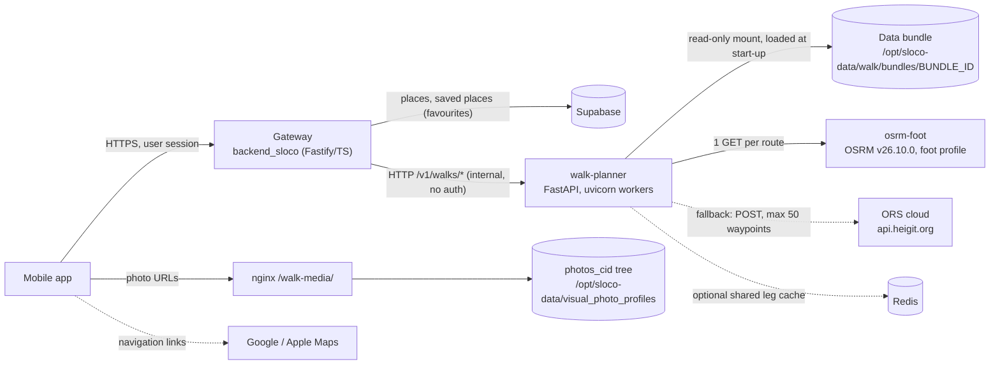
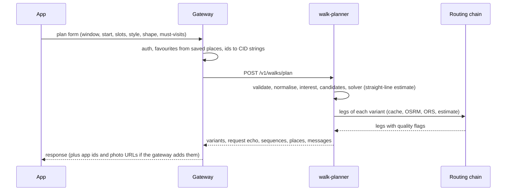
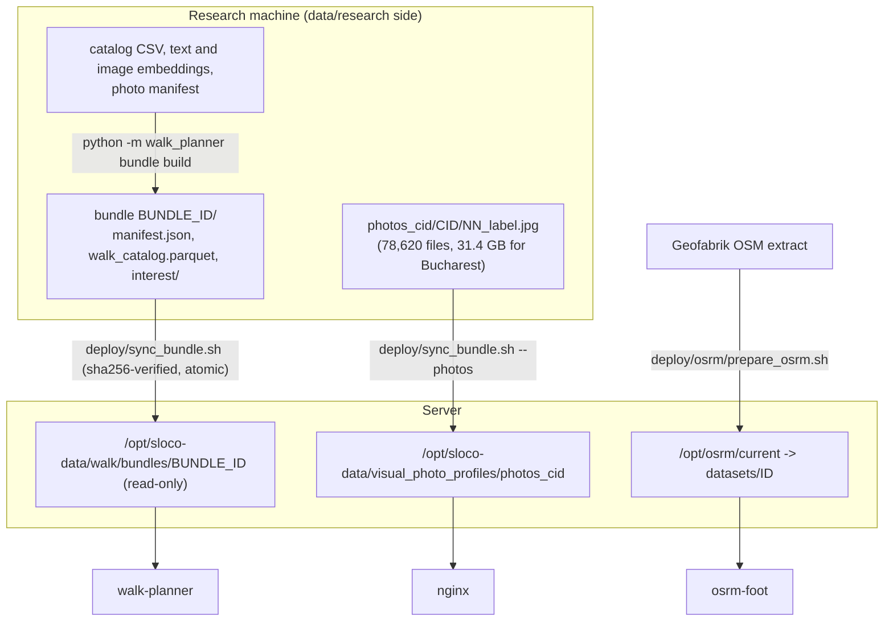

# Walk Planner v1: specification

**Status:** v1.0.0, 2026-10-03.
**Audience:** the backend developer who deploys and integrates the service; anyone who needs the whole picture.
**Scope of this document:** the master overview. Field-level details live in the documents it links:
[API.md](API.md), [messages.md](messages.md), [ALGORITHM.md](ALGORITHM.md), [DATA.md](DATA.md),
[ROUTING.md](ROUTING.md), [INTEGRATION.md](INTEGRATION.md), [DEPLOY.md](DEPLOY.md), [RELEASE.md](RELEASE.md).
The deployment checklist is in [HANDOFF.md](HANDOFF.md).

Contents: 1 Purpose and scope · 2 Architecture · 3 Components and responsibilities · 4 API at a glance ·
5 Request lifecycles · 6 Data flow · 7 Personalization · 8 Routing · 9 Statelessness and editing ·
10 Performance and capacity · 11 Security and privacy · 12 Versioning · 13 Known limitations ·
14 Roadmap · 15 Glossary

---

## 1. Purpose and scope

**Purpose.** A user states a time window, a start, an ordered list of activities and a walking style. The
Walk Planner returns ready-to-walk routes made of real places from the city catalog. Each route is a
timed schedule: arrival, visit and departure per stop, walking legs with geometry, and Google / Apple Maps
links. The user can edit a route, and the service re-times the edited route.

**In scope for v1**

- One city with a data bundle: Bucharest (12,961 places). The service can serve several cities at once,
  one bundle per city; only Bucharest has a bundle today.
- Planning 1–5 variants for a window of 15 minutes to 24 hours. A window may cross midnight. The user
  picks up to 8 activity slots, each activity at most once, out of `sight, coffee, food, bar, park, market,
  entertainment, shopping`. Styles: `max`, `chill`, `scenic`. Shapes: `loop`, `one_way`, `free`.
  Up to 10 must-visit places.
- Opening hours checked at the time of arrival. Closed places get the policy described below (bug 2).
- Personalization by the user's favourite and want-to-go places. The taste model runs in-process.
- Editing without server state: re-time an edited order (`/schedule`), insert a place at its best
  position (`/insert`).
- Place search and a place screen, for picking must-visit places, a start and added places.
- Street geometry and times for the chosen route: self-hosted OSRM, then the ORS cloud, then a
  straight-line estimate. The source is flagged per leg.
- Messages as codes with params, plus text rendered in Russian or English.

**Out of scope for v1:** user accounts and authentication (the gateway does this); storing or sharing
routes; multi-day plans; public transport or taxi legs; a fixed finish point ("from A to B, be there by
HH:MM"); turn-by-turn navigation (the app hands off to Google / Apple Maps); weather, events and tickets.
The algorithm's `auto` mode exists in the core but is not exposed.

**What "v1" means.** v1.0.0 is the research dashboard's algorithm as of research-repo commit `f1b2196`
with only these changes:

- the bug fixes and behaviour changes in [CHANGELOG.md](../CHANGELOG.md);
- the production routing chain;
- the new personalization model;
- strict input validation.

Golden outputs pin the behaviour (see the `golden/` directory). Against the pre-refactor dashboard
(`golden/baseline_v0`), 22 of 24 scenarios are identical. The other two (S05, S19) differ exactly by the two
bug fixes. Everything else that users found wrong stays as it was and is listed in §13. It is planned for
later versions (§14).

---

## 2. Architecture

- **walk-planner** is a Python 3.12 container. It runs uvicorn with `WEB_CONCURRENCY` worker processes
  (default 2) and listens on port 8000. Handlers are synchronous and CPU-bound, so each worker uses
  about one core. The service keeps no state between requests apart from caches.
- **Data bundle:** one immutable directory per city and build: `manifest.json`, `walk_catalog.parquet`
  and the taste artifacts under `interest/`. The service loads it at start-up after checking the sha256 of
  every file, and refuses to start on any mismatch. Bucharest: 60.0 MB. See [DATA.md](DATA.md).
- **osrm-foot** is the self-hosted router. Its dataset is built from OpenStreetMap by
  `deploy/osrm/prepare_osrm.sh`. It is optional at run time, because the chain falls back.
- **ORS cloud** is the OpenRouteService API on the `api.heigit.org` host. It is a metered fallback for
  when OSRM fails, and is used only when `ORS_API_KEY` is set.
- **Redis** is optional. It shares the leg cache between workers; without it each worker keeps its own
  in-process cache.
- **Photos** are static JPEG files served by nginx. Responses carry photo keys; with `PHOTO_BASE_URL`
  set they also carry full URLs.
- **Gateway and Supabase** belong to `backend_sloco`. The planner never talks to Supabase and never sees
  user ids.

Deployment files: `deploy/Dockerfile` (image), `deploy/docker-compose.yml` (walk-planner, osrm-foot and
Redis under the `cache` profile; run standalone and attached to the backend's network, or merged into the
backend's compose as [DEPLOY.md §4.2](DEPLOY.md#42-on-the-backends-network) describes) and `deploy/env.example`
(the variables of `walk.env`). See [DEPLOY.md](DEPLOY.md).

---

## 3. Components and responsibilities

| Component | Built by | Operated by | Responsibility |
|---|---|---|---|
| Package `walk_planner` (this directory) | data/research side | — | Algorithm, catalog, personalization, routing chain, API views, messages, CLI |
| Service `walk-planner` (`walk_planner/service/`) | data/research side | backend | The HTTP API, start-up checks, load guard, JSON logs |
| Image recipe, compose file, env template, lock files | data/research side | backend | Build and run the container; merge it into the backend's compose |
| Data bundle (per city) | data/research side (`bundle build`) | backend mounts it | Catalog, hours, status, photo keys, taste artifacts; immutable, versioned by `bundle_id` |
| Golden scenarios and expected outputs | data/research side | backend runs them at deploy time | Acceptance test: `golden run --url` against the deployed service |
| OSRM dataset | script by data/research side | backend (`prepare_osrm.sh`, e.g. monthly) | Street routing data, `current` / `previous` datasets, rollback |
| ORS account and production key | — | backend / product owner | The fallback router's quota |
| Photo files and their serving | files: data/research side | backend (sync, nginx, optional resizing/CDN) | Card images behind `PHOTO_BASE_URL` |
| Gateway endpoints | — | backend | Auth, favourites from saved places, id mapping (`places.id` and CID), casing, rate limits, timeouts, retries; see [INTEGRATION.md](INTEGRATION.md) |
| Supabase | — | backend | `places`, `saved_places`; whether to import the 5,624 walk places it probably lacks ([HANDOFF.md](HANDOFF.md) step 10) |
| App screens | designer / app developer | — | From `WALK_PLANNER_UX_BRIEF.md` §10 (research repo, not in this package: [HANDOFF.md §1.2](HANDOFF.md#12-files-that-live-outside-this-package)) and this API |
| Research dashboard (Streamlit) | data/research side | data/research side | Test bench; a thin UI over the same package |

Package modules:

| Module | Role |
|---|---|
| `core.py` | The solver: per-slot beam search, must-visit insertion, on-the-way fill, timing with opening hours, legs, navigation links |
| `slots.py` | Activity registry (codes, RU/EN labels, catalog themes, keyword and type filters), styles, shapes, tuning constants |
| `catalog.py` | `CityCatalog`: rows of one city (from a bundle or a DataFrame), hours, business status, cards, photo keys, search |
| `candidates.py` | Candidate pools per slot and for on-the-way stops; the status policy for must-visit and added places |
| `interest.py`, `interest_build.py` | Place interest: cold-start popularity and the taste model of favourites (runtime / offline build) |
| `pipeline.py` | Validation and normalisation of requests; `build_plan`, `schedule`, `insert_place`; request echo |
| `present.py` | JSON views of plans and edits; Russian formatters shared with the dashboard |
| `messages.py` | Message and error catalog: code, severity, scope, params, RU/EN templates, HTTP status |
| `routing.py` | `ChainProvider` (leg cache → OSRM → ORS → estimate), breakers, ORS rate limiter, polyline6 |
| `bundle.py` | Bundle build, validation (layout, sha256, schema, row alignment), loading |
| `cli.py` | Developer CLI; also the API facade (`api_plan`, `api_schedule`, `api_insert`) used to record the golden outputs |
| `service/` | FastAPI app, pydantic schemas (source of `docs/openapi.json`), settings, JSON logging |

---

## 4. API at a glance

Internal HTTP API. Paths start with `/v1`, JSON fields are snake_case, place ids are strings.
`lang` (`ru` | `en`) and `geometry` (`geojson` | `polyline6`) can be query parameters or body fields.
Details: [API.md](API.md), [openapi.json](openapi.json).

| Endpoint | Purpose | Errors (HTTP status, code) |
|---|---|---|
| `GET /v1/health/live` | The process answers | — |
| `GET /v1/health/ready` | Bundles loaded, verified and warm | 503 `not_ready` (`Retry-After: 5`) |
| `GET /v1/meta` | Identity, versions, git sha, bundles, routing state, load guard; counters are per worker | — |
| `GET /v1/walks/config` | Form data: activities, styles, shapes, visit-length choices, defaults, limits | 422 `unknown_city` |
| `POST /v1/walks/plan` | Plan 1–5 variants | 422 (`validation_error`, `unknown_city`, `invalid_window`, `start_required`, `unknown_activity`, `duplicate_activity`, `no_slots_or_must_visits`, `too_many_must_visits`), 404 `unknown_place` (start place), 413, 503 `busy` |
| `POST /v1/walks/schedule` | Re-time an edited order exactly | 404 `unknown_place`, 409 `catalog_changed`, 422 (`validation_error`, `place_closed_forever`), 503 `busy` |
| `POST /v1/walks/insert` | Add a place at its best position | as `/schedule`, plus 409 `place_already_in_route` and 422 `place_temporarily_closed` |
| `GET /v1/walks/places/search` | Name search (diacritics- and case-insensitive) | 422 |
| `GET /v1/walks/places/{place_id}` | Place screen: up to 10 photos, text sections, tags, week hours | 404 `unknown_place` |

Every error body is `{"error": {"code", "message", "params"}}`. Any endpoint can also answer 400
`bad_request`, 404 `not_found`, 405 `method_not_allowed`, 413 `payload_too_large` (body over 1 MiB) or 500
`internal_error`. The `/v1/walks/*` endpoints answer 503 `not_ready` while the service starts or stops;
uvicorn opens its port only after start-up, so a caller usually sees a refused connection instead. A 500
carries the request id and never a stack trace. Data problems are never a 500: a
valid plan request that finds nothing is a 200 with `status: "no_candidates"` or `"no_route"` and a
message saying why. Every response carries `X-Request-Id` (the caller's id when it sends a sane one) and
`X-Process-Time-Ms`. All codes and texts: [messages.md](messages.md), [messages.json](messages.json)
(15 messages, 20 errors).

---

## 5. Request lifecycles

### 5.1 Plan: `POST /v1/walks/plan`

1. **Schema check.** pydantic checks JSON types and formats: `date` is `YYYY-MM-DD`, times are `HH:MM`,
   place ids are strings of 1–20 ASCII digits, `style` and `shape` are known codes, numbers are finite. A
   failure is 422 `validation_error` with `params.errors`. Activity codes are checked in the next step
   (422 `unknown_activity`).
2. **Load guard.** The request takes one of `WALK_MAX_CONCURRENT_PLANS` slots of its worker (default 2).
   When none is free, the answer is an immediate 503 `busy` with `Retry-After: 2`. Requests never queue.
3. **Normalisation** (`pipeline.normalize_params`). Defaults are applied (the defaults block of
   `/v1/walks/config`) and the domain rules are enforced with their own error codes: window 15–1440 min,
   1–5 variants, radius 0.3–50 km, at most 8 unique slots, at most 10 must-visits, at most 500
   favourite + want-to-go ids. `loop` and `one_way` need a start; `free` ignores it.
4. **Context** (`make_context`). The window clock is computed (weekday, minute of the week). The start is
   resolved: the city centre, a catalog place, or coordinates. The search radius is reduced to what the
   window can reach, and the `radius_shrunk` message says so when it happens.
5. **Interest.** Every place of the city gets an interest value in [0, 1]: popularity, or popularity
   blended with the favourites' taste (§7).
6. **Candidates.** For each slot the pipeline takes the 8 most interesting places of the slot's type
   within the radius. It then adds the 8 places (with at least 20 reviews) that best balance walking time
   from the search centre against interest, so a slot has up to 16 candidates. Activity type filters
   apply, closed businesses are excluded, and places closed for the whole window are dropped. A slot with
   no candidate gets `slots_no_candidates`. Must-visit places go through the status policy:
   `closed_forever` ones are left out with `must_visit_closed_forever`, unknown ids are reported in
   `unknown_place_ids`, and `temporarily_closed` ones are kept and flagged. On-the-way candidates are
   also built here.
7. **Solver** (`core.plan_variants`). A beam search picks one place per slot and their order, trading
   walking minutes against interest under the time budget, opening hours (at most a 30-minute wait at the
   door) and a 45-minute cap per leg. Then it inserts the must-visits and fills the window with on-the-way
   stops of at most 10 minutes. It repeats this for each variant, with the interest of places used by
   earlier variants lowered (×0.35). The solver uses only the straight-line estimate, so the router never
   changes which places are chosen or their order. See [ALGORITHM.md](ALGORITHM.md).
8. **Assembly.** For each variant the routing chain returns the legs of the chosen order in one call (§8).
   Then the stops are timed, the hours re-checked, the totals computed and `over_budget` set. Navigation
   links are built.
9. **Response** (`present.plan_response`). It contains:
   - `plan_id` and `versions`;
   - `status` and the normalised `request` echo;
   - `personalization` and the request-level `messages`;
   - per variant: `summary`, `messages`, `stops`, `segments`, `navigation`, `bbox` and the editable
     `sequence`;
   - `places`: one card per place used.

   One JSON access line is logged (§11).

`status` is `ok`, `no_candidates` (nothing to plan with) or `no_route` (candidates exist, but no route
was found). Fewer variants than requested come with `fewer_variants`.

### 5.2 Edit: `POST /v1/walks/schedule` and `POST /v1/walks/insert`

1. The client sends back the `request` echo of the plan (or of the last edit) and a variant's `sequence`.
   It may have reordered it, removed stops, restored removed stops or changed their minutes.
2. The schema check and the load guard work as for a plan. The echo is re-validated
   (`from_request_echo`).
3. Each stop is re-hydrated from the catalog by `place_id`: name, coordinates, opening hours, business
   status. The client never supplies these facts. Each stop's minutes are used as sent (5–480). A place
   that is not in the catalog is 404 `unknown_place`, or 409 `catalog_changed` when the echo comes from
   another bundle. A place now closed forever is 422. Duplicates are refused, and a sequence may hold at
   most 150 stops.
4. **schedule** times the stops exactly in the given order. Nothing is dropped, reordered or swapped. A
   stop that may be closed at its new time is kept and gets `stop_hours_conflict`, and `over_budget` says
   when the order overruns the window.
5. **insert** puts the new place where it adds the least time. It prefers a position where every stop is
   open on arrival and no leg exceeds 45 minutes, and otherwise takes the shortest position. The answers
   are:
   - 409 `place_already_in_route` when the place is already in the route;
   - 422 `place_closed_forever` for a place closed forever;
   - 422 `place_temporarily_closed` for a temporarily closed place, unless the request sets
     `allow_temporarily_closed: true` (the app asks the user first). The stop is then kept and flagged.

   The new stop is `pinned` and `inserted_index` gives its position.
6. The response carries `versions`, `request`, the one re-timed `variant` (with `edited: true`), `places`
   and `messages`. For the next edit the client keeps the new `request` and `variant.sequence`.

### 5.3 Search and place screen

`GET /v1/walks/places/search?q=...` ranks matches in this order: exact name, then prefix, substring, all
words, address. Within a tier it orders by popularity; with `lat` and `lon` given, distance also counts.
Matching ignores diacritics and case. Places closed forever are hidden unless `include_closed=true`.
Temporarily closed places are shown and say so. The limit is 1–50 results (default 20).
`GET /v1/walks/places/{place_id}` returns the place screen. Neither endpoint takes a load-guard slot; both
answer in milliseconds (§10).

### 5.4 Config, meta and health

`/v1/walks/config` gives the app everything the form needs: activity, style and shape codes with labels
in the requested language, visit-length choices, defaults and limits, plus the city's centre and
bounding box. Its values change only with a new version or a new bundle.

`/v1/meta` is for operators. Its routing counters, leg cache and load-guard figures belong to the worker
that answered. `/v1/health/ready` is the container health check; street routing is not part of
readiness.

---

## 6. Data flow

- **Bundles are immutable.** A new build gets a new id `<city>-<YYYYMMDD>-<content hash>`. The content hash
  covers the catalog rows and the taste artifacts. Switching data means changing `WALK_BUNDLE_ID` and
  recreating the container; rolling back means the previous id.
- **At run time** the service reads only the mounted bundle. Requests carry no user identity: only the
  window, start, slots, place ids and options.
- **Photos:** a response carries keys such as `photos_cid/<cid>/<NN>_<vibe|all>.jpg`, and a URL when
  `PHOTO_BASE_URL` is set (`url = PHOTO_BASE_URL + "/" + key`). The gateway may instead rewrite keys
  itself.
- **Coverage of the Bucharest bundle:** opening hours known for 8,296 places (64%), photos for 12,502
  (96.5%), 1,961 closed forever, 481 temporarily closed.

---

## 7. Personalization

Every place has an **interest** value in [0, 1]. The solver trades interest against walking minutes. It
also gates on-the-way stops (minimum 0.3) and ranks the candidate pools.

- **Cold start (no favourites).** The dashboard's popularity formula, byte-identical:
  `0.7 · log1p(reviews) / log1p(max reviews in the city) + 0.3 · clip(rating − 4, 0, 1)`, where rating is
  the `bayesian_rating` column (the `google_rating` column when the catalog has no Bayesian rating), and a
  missing rating makes the quality term 0.3. `personalization.mode` is `popularity`.
- **Favourites (`favourite_place_ids`, `want_to_go_place_ids`).** A numpy port of the v4 feed engine's
  scoring (`interest.py`). Favourites weigh 1.0 and want-to-go places 0.55; at most 200 seeds are used.
  - The seeds are clustered into up to 6 taste profiles: agglomerative cosine clustering, and one
    profile for fewer than 4 seeds. Clustering needs scikit-learn, which the image includes.
  - Each place is scored against each profile with six channels: text embedding 0.26, photo embedding
    (OpenCLIP) 0.50, tags 0.08, vibe axes 0.06, quality 0.06 and price 0.04. A hubness penalty (CSLS,
    k = 10) applies, and the place's taste is its best profile's score.
- **Blend.** Within each catalog theme, places are re-ordered by
  `(1 − s) · percentile(cold) + s · percentile(taste)` with `s = personalization_strength` (default 0.5).
  They then take the theme's cold-start values in that new order. The set of interest values per theme
  stays the same, so the solver's tuned constants keep their meaning; taste only decides which place gets
  which value. Favourites keep their own cold value. `s = 0` is exactly the cold start.
- **Effect** (golden scenarios, variant 1 compared with the cold-start S01 route):
  - P01, three favourites: 2 of its 8 stops are shared with the cold-start route;
  - P02, six favourites in two profiles: 3 of 7 shared.
- **Cost:** 21–26 ms for 3–6 favourites over the 12,961 places, and up to 91 ms for 200 seeds. The old
  dashboard path took about 15 s.
- **Response:** `personalization = {mode, strength, favourites_used, favourites_ignored, profiles}`.
  `favourites_ignored` lists ids that are unknown in this city, have no text embedding, or exceed the
  200-seed cap.
  - When none of the favourites is usable, the plan uses the cold start: `mode` is `popularity`, every id
    is in `favourites_ignored`, and there is no message.
  - When the bundle has no taste artifacts or the taste model fails, the plan also uses the cold start,
    and it carries the message `personalization_unavailable`.
- **Who supplies favourites.** The gateway sends them, for example from the user's saved places. The
  service never stores them. Edits also accept them through the request echo, so edited stops report the
  same interest.

This replaces the dashboard's old personalised path (`_compute_recommendation_df`) in both the dashboard
and the service. Plans without favourites did not change. Details: [ALGORITHM.md](ALGORITHM.md).

---

## 8. Routing

There are two cost models, by design:

- **Optimizer:** always the offline straight-line estimate, haversine distance × 1.35 at 4.5 km/h. Plans
  therefore never depend on the network, and places and order are the same with or without a router.
- **Assembly:** the legs of the chosen route go through the routing chain, one call per variant and per
  edit. The chain provides the displayed times, distances and geometry. A street leg can be shorter or
  longer than its estimate, so `over_budget`, waits and hours flags can differ from the estimate plan; the
  places and their order cannot.

The chain (`routing.ChainProvider`, built per request by `make_provider()` from the environment):

1. **Leg cache.**
   - L1: an in-process LRU of 20,000 legs per worker.
   - L2: optional Redis (`WALK_ROUTE_CACHE_REDIS_URL`) shared by all workers.
   - The key holds the OSRM dataset id and the two points rounded to 5 decimals.
   - TTLs: OSRM legs 30 days, ORS legs 24 hours, legs touching the user's start 1 hour. Estimates are
     never cached.
2. **OSRM** (`WALK_ROUTER_URL`): one `GET /route/v1/foot/...` per route with all legs.
   - Timeouts 0.5 s to connect and 2 s to read, with one retry.
   - A breaker opens for 30 s after 3 failures.
   - The dataset id (OSRM `data_version`) is reported as `versions.routing`.
3. **ORS cloud** (`ORS_API_KEY`, host `https://api.heigit.org/openrouteservice`):
   - one POST per at most 50 waypoints; timeouts 2 s / 8 s; no retries;
   - a local rate limiter, 35/min and 1,800/day per worker by default (`deploy/env.example` sets 17/900
     for 2 workers);
   - its own breaker: 403 quota until the reset time, 401 for 1 h, 429 for the `Retry-After`, 5xx for
     5 min.
4. **Straight-line estimate:** whatever is still missing. Cached street legs are kept.

Every request has a routing budget of 6 s shared by all its variants (`WALK_ROUTING_DEADLINE_S`). A router
that failed in a request is not tried again for its other variants. Failures never raise; they degrade
and say so:

- each segment has `quality` (`streets` | `estimate`) and `provider` (`osrm` | `ors` | `haversine`);
- each variant's `summary.routing` is `streets`, `estimate`, `mixed` or `none` (no legs);
- a variant with estimated legs carries the message `routing_estimate`;
- routing state and counters are in `/v1/meta` → `routing`.

With nothing configured the service uses the estimate only. Details: [ROUTING.md](ROUTING.md).

---

## 9. Statelessness and the editing model

The service stores nothing between requests. A plan response gives the client everything it needs to
edit:

| Client keeps | From | Used for |
|---|---|---|
| `request` (normalised echo, including `catalog_version`) | plan or the last edit response | every `/schedule` and `/insert` call |
| `variants[i].sequence` (`place_id, kind, slot_index, activity, dwell_min, dwell_fixed` per stop) | plan, then `variant.sequence` of each edit | the current order to edit |
| the original variant | plan response | "reset to the planner's route", with no server call |
| removed stops (the "do not visit" bin) | client | restoring a stop: put its sequence item back |
| selected variant, `edited` flag | client / `variant.edited` | UI state |

- The server takes only ids, kinds and minutes from the client. It re-reads every catalog fact by
  `place_id` and recomputes all times.
- A plan made on an older bundle can still be edited after a data update. A place that disappeared gives
  409 `catalog_changed`, and the app should re-plan.
- `plan_id` is the sha1 of the normalised request and the versions. The same request on the same versions
  gives the same id, which makes it a cache or deduplication key, not a handle; the server cannot look a
  plan up by it.
- Any worker or replica can serve any request. Per-worker state is limited to caches and counters.

---

## 10. Performance and capacity

This section is the reference for every latency, start-up and size figure in these documents; the other
documents round these numbers and link here. The production host has not been measured; re-check during the
acceptance ([HANDOFF.md](HANDOFF.md) step 7).

The latency table was measured on 2026-10-03 with one script, one request at a time, against the real Bucharest
bundle with straight-line routing (golden request bodies). Values are the server time (`X-Process-Time-Ms`), p50 /
p90; the client adds about 1 ms. Two set-ups on the same Apple M1 Pro, which other jobs shared (load average 5–10):

- **Local:** `python -m walk_planner serve`, one uvicorn worker, macOS, Python 3.13.
- **Image:** the service image under Docker Desktop (arm64 Linux VM), Python 3.12.15, 2 workers, as compose runs
  it. Expect the production host to resemble this column more than the first.

| Operation | Local | Image |
|---|---|---|
| Plan S01: 4 h, 4 slots, 3 variants, no favourites | 306 / 314 ms | 432 / 473 ms |
| Plan P01: the same with 3 favourites | 354 / 366 ms | 503 / 547 ms |
| Plan P02: the same with 6 favourites (2 taste profiles) | 334 / 379 ms | 465 / 508 ms |
| Plan S08: 24 h window (largest variant 55 stops) | 3.21 / 3.22 s | 4.03 / 4.07 s |
| `/schedule` / `/insert` (S01 edits) | 2.9 / 3.3 ms | 3.2 / 3.8 ms |
| `/schedule` with the 3 favourites of P01 in the echo (the taste model runs again) | 30 ms | 53 ms |
| Search: a name (`stavropoleos`) / a common word near a point (`cafe`, `lat`, `lon`) | 8.3 / 10.8 ms | 12.6 / 14.6 ms |
| Place screen / config / meta | 0.5 / 0.2 / 0.2 ms | 0.7 / 0.3 / 0.3 ms |

Two plans running at once in one worker share its core: each then takes about twice as long (6.5 s for a 24 h
plan, see the load-guard row below).

| Other measurement | Result |
|---|---|
| Start-up, real bundle (sha256 check of 7 files + load 0.22 s, warm-up 1.34 s, smoke plan 0.39 s) | `startup_ms` 1,893 (local, 2026-10-03; 1,946 on 2026-10-02) and 1,688 per worker in the image; ready about 3 s after the process starts |
| Container (2 workers, Docker Desktop) ready after `docker compose up -d` | 5.6 s (2026-10-03); compose shows `healthy` only after the first health check, about 30 s after start |
| `golden run --url` (26 scenarios, every edit call) against the image | 22.5 s |
| Street routing with OSRM (Bucharest clip, S01) | 23 legs in one request; router time 9.8 ms; an identical second request served all 23 legs from the leg cache; schedule 13 ms, insert 15 ms |
| 30 concurrent S01 plans, 1 worker, before the load guard existed | all 200 in 10.8 s (about 2.8 plans/s) |
| Load guard: 6 concurrent 24 h plans, 1 worker, limit 2, clients send once | 2 served (6.5–6.6 s each); 4 refused with 503 `busy` + `Retry-After: 2` within 24 ms |
| Burst of 30 large plans, 2 workers, limit 2, clients retry | done in 71 s; p50 34 s; peak 0.64 GB per worker, 1.1 GB per container; search p50 75 ms meanwhile |
| Same burst without a limit (64) | 68 s; p50 56 s; peak 1.12 GB per worker, 2.1 GB per container; search up to 1.9 s |
| Memory, idle | ~0.5 GB RSS per worker + ~0.13 GB uvicorn supervisor |
| Image | 905 MB unpacked, about 200 MB compressed |
| Response size (compact JSON, GeoJSON straight-line geometry, no `PHOTO_BASE_URL`) | S01 plan 57.3 KB (3 variants; 55.8 KB with `polyline6`); P01 65.9 KB; S08 24 h plan 245.6 KB; schedule 21.7 KB; insert 23.6 KB; place screen 5.0 KB; config 2.6 KB (`en`) or 2.8 KB (`ru`). Photo URLs add about 10 %; street geometry adds points ([INTEGRATION.md §3.11](INTEGRATION.md#311-payload-sizes-and-geometry)) |

**Capacity rules.**

- One worker uses about one core. Add workers (`WEB_CONCURRENCY`) and CPUs together. Allow about
  1.3 GB of memory per worker: the compose limit is 3 GB for 2 workers.
- At most `WEB_CONCURRENCY × WALK_MAX_CONCURRENT_PLANS` plans, schedules and inserts run at once (4 by
  default). More are refused immediately with 503 `busy`, and the gateway retries or tells the user.
  Search, place, config, meta and health are never limited.
- Gateway timeouts and retries: [INTEGRATION.md](INTEGRATION.md) §3.5. For `/plan` that means 20 s, never
  below 15 s, because the routing budget alone is 6 s. A plan is never re-sent after a timeout.

---

## 11. Security and privacy

- **Network.** The service is internal and has no authentication. It must only be reachable from the
  backend network: compose publishes it on `127.0.0.1:18600` only, and `osrm-foot` and Redis are never
  published. The gateway authenticates users.
- **No user identity.** Requests carry no user ids. Favourites are place ids only and the service does not
  store them.
- **Logs** are one JSON access line per request:
  - endpoint, status and timings;
  - plan summary: shape, slot codes, stop counts, routing quality;
  - favourites only as counts plus a salted 12-hex digest;
  - the start rounded to 2 decimals (about 1 km);
  - for searches the query length, never the text.

  uvicorn's own access log is off because it would print query strings with coordinates. uvicorn's other
  lines are JSON too.
- **Third parties.** When OSRM is down and ORS is configured, the route's coordinates go to HeiGIT's ORS
  cloud, including the user's start. OSRM is self-hosted. Navigation links are opened by the user's device.
- **Caches.** A leg that touches the user's start is cached for 1 hour at most. The cache stores hashed
  keys and leg geometry, never user ids.
- **Secrets.** `ORS_API_KEY` and a password-bearing Redis URL go only into `walk.env` (mode 600):
  - never under compose `environment:`, never on a command line;
  - `docker compose config` prints them, so its output must not be shared;
  - `/v1/meta` strips credentials, query strings and fragments from every URL;
  - the routing config's repr hides secrets.
- **Container.**
  - It runs as uid 10001 with a read-only root filesystem, all capabilities dropped,
    `no-new-privileges` and a tmpfs `/tmp`.
  - The bundle is mounted read-only. The image holds no data, tests or secrets, and its base is pinned
    to `python:3.12.15-slim-trixie`.
- **Input.**
  - Bodies over 1 MiB are refused with 413. JSON types are strict; NaN and Infinity are refused.
  - Place ids are digit strings, and string lengths are capped.
  - The stage-2 verifier sent 2,076 malformed requests; none got a 5xx or a body outside the error
    envelope.
- **Data integrity.**
  - Every bundle file is sha256-checked at start-up.
  - The bundle layout is checked: required files listed, no absolute paths, no `..`, no symlinks out of
    the bundle.
  - The image entrypoint validates the bundle first and exits 78 when it is missing or corrupt.
- **Photos** are public static URLs of third-party place photos. Whether they may be world-readable is an
  open question ([HANDOFF.md](HANDOFF.md) §4). The nginx example also shows signed URLs.
- **Attribution.** Routes come from OpenStreetMap data (ODbL), so the app must show "© OpenStreetMap
  contributors" where it draws them. Where ORS legs are shown it must show "© openrouteservice.org by
  HeiGIT | Map data © OpenStreetMap contributors". Confirm that text and the commercial-use terms on
  HeiGIT's terms page ([ROUTING.md](ROUTING.md) §6.5).

---

## 12. Versioning

| Identifier | Value | Changes when |
|---|---|---|
| `ALGORITHM_VERSION` (= package version, image tag) | `1.0.0` | MAJOR: API contract break · MINOR: intended change of plans (golden outputs regenerated in the same release) · PATCH: no golden output changes |
| `API_VERSION` | `v1` | the path prefix of every endpoint |
| `BUNDLE_SCHEMA_VERSION` | `1` | the bundle layout changes |
| `INTEREST_VERSION` | `walk_interest_v1` | the personalization model changes |
| `bundle_id` | `bucharest-20261002-d68a311e` | every data build (new content gives a new id) |
| routing dataset | e.g. `romania-clip-261001` | every OSRM data build (`prepare_osrm.sh`) |

Every plan or edit response carries `versions = {api, algorithm, catalog, interest, routing}`. The expected
golden outputs are stored per bundle id (`golden/expected/<bundle_id>/`). A release is accepted by
replaying them against the deployed service. How releases are made and delivered: [RELEASE.md](RELEASE.md).
History: [CHANGELOG.md](../CHANGELOG.md).

---

## 13. Known limitations of v1

v1 keeps the dashboard's planning behaviour on purpose. In the user test of 2026-09-26, six test agents
played user personas and rated the dashboard 3.7 out of 10 on average. Its findings still apply.

"WP-" numbers point to that report,
`recommendation_system/ai_location_recommender/WALK_PLANNER_UX_TEST_REPORT.md` in the research repo (in Russian).
The report is not part of this package; the links below work inside a research-repo checkout, and the
[index at the end of this section](#index-of-user-test-ids) gives the English title of every WP and I id these
documents mention. "D" numbers refer to the code review of the core during the v1 work, listed after the table.

| # | Limitation | What the user sees | Refs |
|---|---|---|---|
| 1 | Slot candidates come from theme and keyword filters with no quality threshold | Wrong type or junk in a slot (a casino as "entertainment", a barber as "bar"); low-rated chains | [WP-02](../../../recommendation_system/ai_location_recommender/WALK_PLANNER_UX_TEST_REPORT.md#wp-02), [WP-03](../../../recommendation_system/ai_location_recommender/WALK_PLANNER_UX_TEST_REPORT.md#wp-03) |
| 2 | Meals are not tied to meal times; each activity once per walk (API: 422 `duplicate_activity`) | "Lunch" at 10:00; no two meals or bar-hopping | [WP-12](../../../recommendation_system/ai_location_recommender/WALK_PLANNER_UX_TEST_REPORT.md#wp-12), [WP-13](../../../recommendation_system/ai_location_recommender/WALK_PLANNER_UX_TEST_REPORT.md#wp-13) |
| 3 | On-the-way stops can be detours, can be too many, and can be churches at night. Later variants of long windows lose them (D8) | Many short stops, 30–40-minute detours; variants 3–5 of a 24 h walk nearly empty | [WP-24](../../../recommendation_system/ai_location_recommender/WALK_PLANNER_UX_TEST_REPORT.md#wp-24), [WP-25](../../../recommendation_system/ai_location_recommender/WALK_PLANNER_UX_TEST_REPORT.md#wp-25), [WP-26](../../../recommendation_system/ai_location_recommender/WALK_PLANNER_UX_TEST_REPORT.md#wp-26) |
| 4 | Unknown opening hours count as open (64% of places have hours); no daylight model | Museums, parks and churches in evening and night walks | [WP-16](../../../recommendation_system/ai_location_recommender/WALK_PLANNER_UX_TEST_REPORT.md#wp-16) |
| 5 | The route can exceed the window: must-visits are inserted without a budget (D5); a closed must-visit disables later checks and the on-the-way fill (D4); the return leg of a loop is not capped in the solver (D3); street legs can be longer than the estimate; assembly accepts waits up to 90 min | Finish after "end"; `over_budget: true` and negative `slack_min` (always flagged, never hidden) | [WP-15](../../../recommendation_system/ai_location_recommender/WALK_PLANNER_UX_TEST_REPORT.md#wp-15), [WP-19](../../../recommendation_system/ai_location_recommender/WALK_PLANNER_UX_TEST_REPORT.md#wp-19) |
| 6 | No merging of duplicates (one building or park listed several times) | 2–6 consecutive stops at the same place | [WP-05](../../../recommendation_system/ai_location_recommender/WALK_PLANNER_UX_TEST_REPORT.md#wp-05) |
| 7 | No finish point or "be there by"; `free` uses the city centre and the user cannot pick a district | Cannot plan "from the hotel to the meeting by 14:30" | [WP-27](../../../recommendation_system/ai_location_recommender/WALK_PLANNER_UX_TEST_REPORT.md#wp-27), [WP-28](../../../recommendation_system/ai_location_recommender/WALK_PLANNER_UX_TEST_REPORT.md#wp-28) |
| 8 | Visit lengths are estimated per place type; the Google type wins over the slot (D15) | A coffee stop of 75 min, fast food of 75–98 min, a big museum of 10 min as an on-the-way stop | [WP-17](../../../recommendation_system/ai_location_recommender/WALK_PLANNER_UX_TEST_REPORT.md#wp-17), [WP-07](../../../recommendation_system/ai_location_recommender/WALK_PLANNER_UX_TEST_REPORT.md#wp-07) |
| 9 | The Russian texts reproduce the dashboard's word for word, including messages that name the wrong reason; the texts of the new v1 messages are drafts awaiting product sign-off | "Did not fit" when the place is simply closed at that time | [WP-42](../../../recommendation_system/ai_location_recommender/WALK_PLANNER_UX_TEST_REPORT.md#wp-42) |
| 10 | Personalization is new and not yet tested with users; there is no "already visited" and no "local" mode | Popular places again and again | [WP-08](../../../recommendation_system/ai_location_recommender/WALK_PLANNER_UX_TEST_REPORT.md#wp-08), [WP-10](../../../recommendation_system/ai_location_recommender/WALK_PLANNER_UX_TEST_REPORT.md#wp-10) |

Also open: the start is counted as a slot place ([WP-06](../../../recommendation_system/ai_location_recommender/WALK_PLANNER_UX_TEST_REPORT.md#wp-06));
short windows drop the most important slot ([WP-18](../../../recommendation_system/ai_location_recommender/WALK_PLANNER_UX_TEST_REPORT.md#wp-18));
search has no Russian aliases ([WP-09](../../../recommendation_system/ai_location_recommender/WALK_PLANNER_UX_TEST_REPORT.md#wp-09));
variants are unlabelled and often similar ([WP-32](../../../recommendation_system/ai_location_recommender/WALK_PLANNER_UX_TEST_REPORT.md#wp-32)).

Already fixed in v1:

- [WP-04](../../../recommendation_system/ai_location_recommender/WALK_PLANNER_UX_TEST_REPORT.md#wp-04),
  closed places (bug 2);
- [WP-50](../../../recommendation_system/ai_location_recommender/WALK_PLANNER_UX_TEST_REPORT.md#wp-50),
  shifted segments of the `free` shape (bug 1);
- [WP-01](../../../recommendation_system/ai_location_recommender/WALK_PLANNER_UX_TEST_REPORT.md#wp-01),
  silent routing fallback and the exhausted ORS quota: own router, leg cache, quality flags.

Partly addressed:

- [WP-48](../../../recommendation_system/ai_location_recommender/WALK_PLANNER_UX_TEST_REPORT.md#wp-48), build
  time: a 4 h plan takes 0.3–0.45 s (§10), against 30–40 s with interests in the dashboard;
- [WP-45](../../../recommendation_system/ai_location_recommender/WALK_PLANNER_UX_TEST_REPORT.md#wp-45), the
  timeline: segments carry walk minutes, distance and depart / arrive times;
- [WP-40](../../../recommendation_system/ai_location_recommender/WALK_PLANNER_UX_TEST_REPORT.md#wp-40), place
  details: the place screen endpoint returns text sections, tags and week hours.

**Core defects found in the v1 review and their status** (with the code locations and a golden example
for each: [ALGORITHM.md](ALGORITHM.md) §19):

| D | Defect | v1 status |
|---|---|---|
| D2 | `free` with a start shifted the solver's arrival times | Neutralised: the API ignores the start for `free` |
| D3 | Loop: the solver does not cap the return leg at 45 min, but the strict check does, which then disables the on-the-way fill | Kept |
| D4 | A must-visit placed in closed hours makes every later strict check fail: no on-the-way stops, later must-visits ignore hours | Kept |
| D5 | Must-visit insertion ignores the budget (a flat 10 min of walking is reserved per must-visit) | Kept; flagged by `over_budget` |
| D6 | Must-visit minutes are not scaled by the style (`chill` ×1.3) | Kept |
| D7 | The beam can prune states that would have fitted more slots (heuristic, not exact) | Kept; 0 of 8 real cases differed from a 20,000-wide beam |
| D8 | Places reused from earlier variants with interest below 0.857 drop below the on-the-way threshold | Kept |
| D9 | `Stop.interest` of variants 2+ showed the penalised value | Fixed at the API: the original interest is reported |
| D10 | ORS: one request per leg after any failure, silent fallback | Fixed: routing chain (§8) |
| D11 | An empty loop route produced a start→start segment, a router call and a navigation link | Fixed |
| D12 | `auto` mode ignores waits and must-visits | Not exposed |
| D13 | Unknown styles and shapes accepted silently; `loop` / `one_way` without a start | Fixed at the API: 422 |
| D14 | Without a time budget a slot can be skipped for free | Kept |
| D15 | Visit length looks up the Google type before the slot's theme | Kept (product decision, WP-17) |
| D16 | Opening hours `[]` mean "never open" while missing hours mean "always open" | Kept; no such rows in the Bucharest data |
| D17 | Visit-length rounding uses Python's round-half-to-even | Kept (parity) |

### Index of user-test ids

The titles of the user-test report's items, translated from Russian. Each item in the report has the evidence,
the personas that hit it and a proposed fix. WP-39, WP-46 and WP-47 are not referenced elsewhere in these documents
but are listed for completeness.

| Id | Title |
|---|---|
| WP-01 | The router's quota runs out within minutes, and the switch to straight lines is silent |
| WP-02 | Slots are filled with places of the wrong type, and with junk |
| WP-03 | Low quality: 3.3–3.6★ places, fast-food chains, tourist traps |
| WP-04 | Permanently and temporarily closed places get into the route without a warning |
| WP-05 | Duplicates: one building or park becomes several stops in a row |
| WP-06 | The start point counts as a slot |
| WP-07 | Major museums become 10-minute on-the-way stops, small churches become main slots |
| WP-08 | The same popular places every time; no "hidden gems", no "already visited" |
| WP-09 | Place search: diacritics, Russian names, ranking, internal ids |
| WP-10 | Personalization by favourite places is barely noticeable and slow |
| WP-11 | Missing place types: viewpoints, places for children, food markets, kinds of bars |
| WP-12 | Meals are not at meal times |
| WP-13 | An activity cannot be chosen twice |
| WP-14 | The window is used poorly: slots bunched at the start, an empty evening, "+627 min spare" shown in green |
| WP-15 | A must-visit place is scheduled when it is closed, even when the window allows arriving while it is open |
| WP-16 | Evening and night: unknown hours count as open; parks and churches after dark |
| WP-17 | Unrealistic visit lengths |
| WP-18 | Short window: the plan does not shrink, and the most important slot is dropped |
| WP-19 | The automatic variant overruns the window; «−0 мин, не успеваю» |
| WP-20 | No buffer time and no "be there by" |
| WP-21 | Kitchen hours and a margin before closing |
| WP-22 | Waiting for opening: no offer to leave later; a coffee "did not fit" although waiting would work |
| WP-23 | No break in the day, and no two windows in one day |
| WP-24 | An on-the-way stop is really a detour |
| WP-25 | On-the-way stops are the wrong places and too many: churches, galleries, 20–55 stops |
| WP-26 | In edits, on-the-way stops do not give way: lateness and a flood of warnings |
| WP-27 | No finish point: "from A to B, be there by HH:MM" |
| WP-28 | The `free` shape ("around the area") is unclear: no district choice, a given start is ignored |
| WP-29 | No limits on the length of a leg or the distance of a day |
| WP-30 | Walking only: no metro or taxi to the start or for long legs |
| WP-31 | Start: no "my location", "now", address or saved points |
| WP-32 | Variants are unlabelled, similar to each other, and use the window differently |
| WP-33 | Bug (dashboard): after a new build "Variant 2" is selected while variant 1 is shown |
| WP-34 | An added or must-visit place does not replace the slot of the same type, and goes "where it is cheapest" |
| WP-35 | No "replace with a similar place" |
| WP-36 | No hints, no undo, no "order optimally" |
| WP-37 | No fixed time at a stop |
| WP-38 | The order of the slots in the form cannot be changed |
| WP-39 | No "tired, end here" |
| WP-40 | Useful place information exists in the data but is not shown |
| WP-41 | Language and data: English descriptions, Danish names, sections that do not fit the place type |
| WP-42 | Messages name the wrong reason and contradict each other |
| WP-43 | No explanation of why a place was chosen |
| WP-44 | The cover photos do not help to decide |
| WP-45 | Between stops you cannot see how long the walk is and when to leave |
| WP-46 | Mobile layout |
| WP-47 | The map |
| WP-48 | Building a plan takes 30–40 s without a progress indicator |
| WP-49 | The form: many actions, nothing is remembered, traps |
| WP-50 | Bug: with the "around the area" shape the segments are shifted by one stop |
| I-1 | Scenarios and presets instead of slots |
| I-2 | Themed routes |
| I-3 | Multi-day plans, history, "already visited" |
| I-4 | "Walking now": a walk in real time |
| I-5 | Weather, sunset and sunrise, events |
| I-6 | Amenities and accessibility |
| I-7 | Food filters and budget |
| I-8 | Sharing, planning together, export, offline |
| I-9 | Tickets, booking, tours |
| I-10 | Safety |

---

## 14. Roadmap

From the work plan of the UX test report (its §12). Stage durations are the report's estimates. Version
numbers are indicative: every stage changes plans, so each ships as a MINOR release with new golden
outputs, inside API v1 unless the API must break. The product owner sets the order.

| Stage | Content (UX report ids) | Indicative version |
|---|---|---|
| 1. "Stop lying" (1–2 weeks: filters, data, texts) | Place quality and types (WP-02, WP-03); duplicates (WP-05); start not a slot (WP-06); museums not "on the way" (WP-07); on-the-way limits: detour cap, ceiling, variety (WP-24, WP-25, WP-26); realistic visit lengths (WP-17); variants inside the window (WP-19); typical hours for unknown places and sunset (WP-16); message texts (WP-42). Done in v1: WP-04, WP-50, WP-01, WP-33 (dashboard) | 1.1 |
| 2. "Time and goal" (2–3 weeks) | Meal windows and fixed times (WP-12, WP-37); repeated slots and a slot builder (WP-13, WP-38); spreading over the window (WP-14); planning around must-visits (WP-15); short windows (WP-18); buffer time (WP-20); finish point "from A to B" (WP-27); leg and day distance limits (WP-29); a break (WP-23); waiting for opening (WP-22); kitchen hours (WP-21) | 1.2 |
| 3. "Clarity and control" (with the app design) | Variant labels and variety (WP-32); editor: replace a slot on add, "replace with similar", undo (WP-34, WP-35, WP-36); place card badges, translation, "why here" (WP-40, WP-41, WP-43); search and start (WP-09, WP-31); timeline, map, speed, form (WP-45 to WP-49); taste tags, new place types, "for locals" / "already visited" (WP-10, WP-11, WP-08) | 1.3+ |
| 4. New features | Scenarios and presets (I-1); "walking now" mode (I-4); multi-day plans and history (I-3); transport (WP-30); districts for `free` (WP-28); weather and events (I-5); food filters (I-7); sharing and export (I-8); tickets (I-9); amenities (I-6); safety (I-10); themed walks (I-2) | 1.x / 2.0 |

---

## 15. Glossary

| Term | Meaning |
|---|---|
| **Window** | The walk's time span, from `start_time` to `end_time` on `date` (city-local). It may end the next day (`end_day_offset: 1`). It is 15–1440 minutes long; `window_min` is its length. |
| **Slot** | One requested activity (`sight`, `coffee`, ...) in an ordered list of at most 8, each activity at most once. The planner fills each slot with one place, or leaves it empty when nothing fits (`dropped_slot_indices`). |
| **Stop** | A place in a route with arrival, visit start, departure, minutes, wait and an opening-hours status. Its `kind` is `slot`, `on_the_way` or `pinned`. |
| **On-the-way stop** (extra) | An optional short stop (at most 10 min) added to use a long window; "can be skipped". `kind: "on_the_way"`, `slot_index: null`, `activity` says which pool it came from. |
| **Pinned stop** | A place the user chose: a must-visit or a place added in the editor. It always stays in the route. `kind: "pinned"`. |
| **Must-visit** | A place the plan must include (`must_visit_place_ids`, at most 10). |
| **Variant** | One of up to 5 different routes for the same request. Later variants avoid places of earlier ones. |
| **Style** | How the window is used: `max` (most places), `chill` (fewer places, longer visits), `scenic` (parks and squares, less weight on walking). |
| **Shape** | `loop` (back to the start), `one_way` (ends at the last stop), `free` (no start; the area is the city centre). |
| **Visit minutes** (`dwell_min`) | Time spent at a stop. Estimated per place, or set by the user (5–480). `dwell_fixed` marks user-set minutes. |
| **Wait** (`wait_min`) | Minutes at the door before a place opens. |
| **Slack** (`slack_min`) | Window minus the route's total time. Negative means over budget. |
| **`over_budget`** | The route ends after the window. |
| **TimePoint** | `{offset_min, local}`: minutes from the window start and the local clock `YYYY-MM-DDTHH:MM`. |
| **Segment** | One walking leg between two points (start or stops): minutes, metres, depart / arrive, geometry, `quality`, `provider`. |
| **Routing quality** | Per segment `streets` or `estimate`; per variant `streets`, `estimate`, `mixed` or `none`. |
| **Straight-line estimate** | Haversine distance × 1.35 at 4.5 km/h. The optimizer always uses it; displayed legs use it when no router answers. |
| **Sequence** | A variant's stops in their editable form (`place_id, kind, slot_index, activity, dwell_min, dwell_fixed`). The client sends it back to edit. |
| **Request echo** | The normalised plan request returned as `request` (with derived fields such as `window_start` and `catalog_version`). It comes back with every edit. |
| **`plan_id`** | sha1 of the request echo and the versions. Same request, same data, same id. |
| **Interest** | A place's value for the solver in [0, 1]: popularity (cold start), optionally re-ordered by taste. |
| **Taste profile** | A cluster of the user's favourites; a place's taste is its best profile's score. |
| **Personalization strength** | `s` in [0, 1]: 0 means popularity only; the default 0.5 mixes popularity and taste ranks equally. |
| **Bundle** | The immutable data directory of one city: manifest, catalog parquet, taste artifacts. Identified by `bundle_id` (= `versions.catalog`). |
| **`place_id`** | The Google Maps CID as a decimal string (up to 20 digits, beyond int64). Never a number. Equals Supabase `places.source_id`. |
| **Business status** | `operational`, `temporarily_closed` or `closed_forever`, from Google. |
| **Golden outputs** | Recorded API responses of 26 Bucharest scenarios (and 8 for the mini city). A version must reproduce them, or ship new ones on purpose. |
| **baseline_v0** | The frozen pre-refactor dashboard outputs used to prove that the extraction changed nothing but the bug fixes. |
| **Load guard** | The per-worker limit of concurrent plan, schedule and insert requests. One more gets 503 `busy`. |
| **Leg cache** | Cache of routed legs (in-process, optionally Redis) keyed by the OSRM dataset and the two points. |
| **Data version / dataset** | The OSRM dataset id (`<name>-<YYMMDD>`), reported as `versions.routing`. |
| **Gateway** | `backend_sloco`, the app's backend (Fastify/TS); the only caller of the service. |
